# 一、新增套餐

## 1、需求分析和设计

### 1.1、产品原型

新增套餐原型：

添加菜品原型：

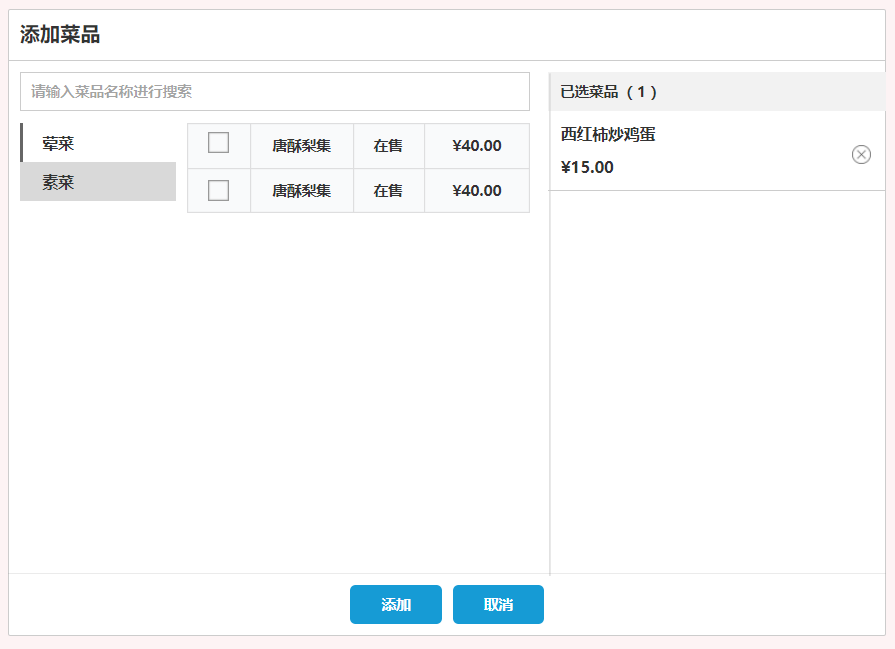

业务规则：

- 套餐名称唯一
- 套餐必须属于某个分类
- 套餐必须包含菜品
- 名称、分类、价格、图片为必填项
- 添加菜品窗口需要根据分类类型来展示菜品
- 新增的套餐默认为停售状态

### 1.2、接口设计

接口设计（共涉及到 4 个接口）：

- 根据类型查询分类（已完成）
- 根据分类 id 查询菜品
- 图片上传（已完成）
- 新增套餐

**1.根据分类 id 查询菜品**

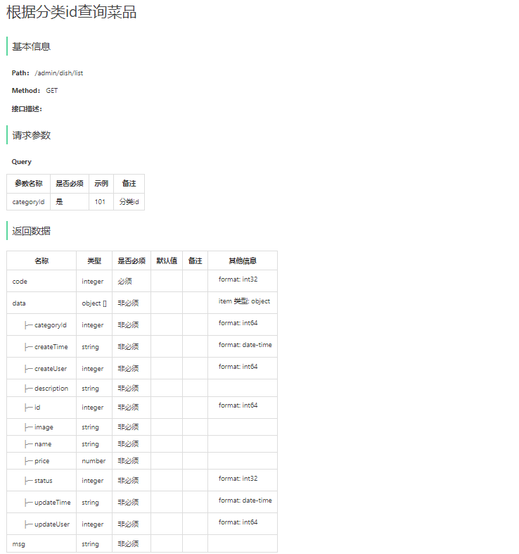

**2.新增套餐**

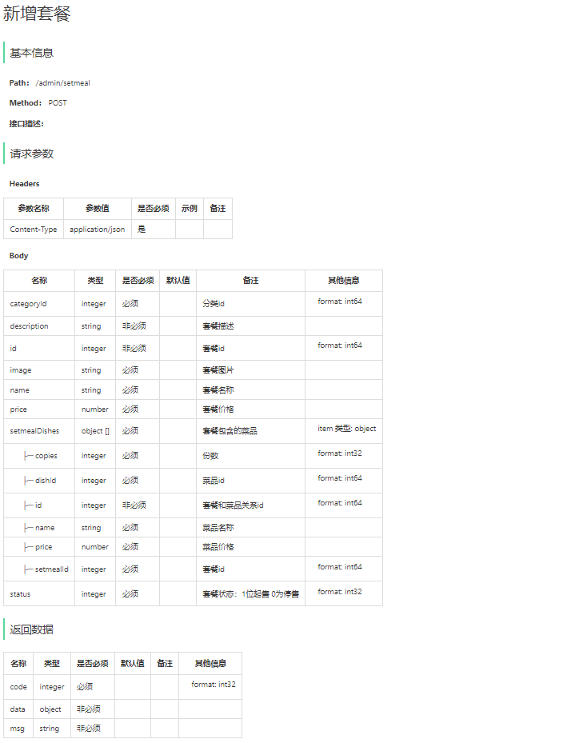

### 1.3、数据库设计

setmeal 表为套餐表，用于存储套餐的信息。具体表结构如下：

| 字段名      | 数据类型      | 说明         | 备注        |
| ----------- | ------------- | ------------ | ----------- |
| id          | bigint        | 主键         | 自增        |
| name        | varchar(32)   | 套餐名称     | 唯一        |
| category_id | bigint        | 分类id       | 逻辑外键    |
| price       | decimal(10,2) | 套餐价格     |             |
| image       | varchar(255)  | 图片路径     |             |
| description | varchar(255)  | 套餐描述     |             |
| status      | int           | 售卖状态     | 1起售 0停售 |
| create_time | datetime      | 创建时间     |             |
| update_time | datetime      | 最后修改时间 |             |
| create_user | bigint        | 创建人id     |             |
| update_user | bigint        | 最后修改人id |             |

setmeal_dish 表为套餐菜品关系表，用于存储套餐和菜品的关联关系。具体表结构如下：

| 字段名     | 数据类型      | 说明     | 备注     |
| ---------- | ------------- | -------- | -------- |
| id         | bigint        | 主键     | 自增     |
| setmeal_id | bigint        | 套餐id   | 逻辑外键 |
| dish_id    | bigint        | 菜品id   | 逻辑外键 |
| name       | varchar(32)   | 菜品名称 | 冗余字段 |
| price      | decimal(10,2) | 菜品单价 | 冗余字段 |
| copies     | int           | 菜品份数 |          |

## 2、代码实现

### 2.1、根据分类 id 查询菜品实现

**1）DishController**

~~~java
/**
 * 根据分类id查询菜品
 * @param categoryId
 * @return
 */
@GetMapping("/list")
@ApiOperation("根据分类id查询菜品")
public Result<List<Dish>> list(Long categoryId){
    log.info("根据分类id查询菜品：{}",categoryId);
    List<Dish> list = dishService.list(categoryId);
    return Result.success(list);
}
~~~

**2）DishService**

~~~java
/**
 * 根据分类id查询菜品
 * @param categoryId
 * @return
 */
List<Dish> list(Long categoryId);
~~~

**3）DishServiceImpl**

~~~java
/**
 * 根据分类id查询菜品
 * @param categoryId
 * @return
 */
public List<Dish> list(Long categoryId) {
    Dish dish = Dish.builder()
        .categoryId(categoryId)
        .status(StatusConstant.ENABLE)
        .build();
    return dishMapper.list(dish);
}
~~~

**4）DishMapper**

~~~java
/**
 * 动态条件查询菜品
 * @param dish
 * @return
 */
List<Dish> list(Dish dish);
~~~

**5）DishMapper.xml**

~~~xml
<select id="list" resultType="Dish" parameterType="Dish">
    select * from dish
    <where>
        <if test="name != null">
            and name like concat('%',#{name},'%')
        </if>
        <if test="categoryId != null">
            and category_id = #{categoryId}
        </if>
        <if test="status != null">
            and status = #{status}
        </if>
    </where>
    order by create_time desc
</select>
~~~

### 2.2、新增套餐实现

**1）SetmealController**

~~~java
/**
 * 套餐管理
 */
@RestController
@RequestMapping("/admin/setmeal")
@Api(tags = "套餐相关接口")
@Slf4j
public class SetmealController {
    @Autowired
    private SetmealService setmealService;

    /**
     * 新增套餐
     * @param setmealDTO
     * @return
     */
    @PostMapping
    @ApiOperation("新增套餐")
    public Result save(@RequestBody SetmealDTO setmealDTO) {
        log.info("新增套餐：{}",setmealDTO);
        setmealService.saveWithDish(setmealDTO);
        return Result.success();
    }
}
~~~

**2）SetmealService**

~~~java
public interface SetmealService {
    /**
     * 新增套餐，同时需要保存套餐和菜品的关联关系
     * @param setmealDTO
     */
    void saveWithDish(SetmealDTO setmealDTO);
}
~~~

**3）SetmealServiceImpl**

~~~java
/**
 * 套餐业务实现
 */
@Service
@Slf4j
public class SetmealServiceImpl implements SetmealService {
    @Autowired
    private SetmealMapper setmealMapper;
    @Autowired
    private SetmealDishMapper setmealDishMapper;
    @Autowired
    private DishMapper dishMapper;

    /**
     * 新增套餐，同时需要保存套餐和菜品的关联关系
     * @param setmealDTO
     */
    @Override
    @Transactional
    public void saveWithDish(SetmealDTO setmealDTO) {
        Setmeal setmeal = new Setmeal();
        BeanUtils.copyProperties(setmealDTO, setmeal);

        //向套餐表插入数据
        setmealMapper.insert(setmeal);

        //获取生成的套餐id
        Long setmealId = setmeal.getId();

        List<SetmealDish> setmealDishes = setmealDTO.getSetmealDishes();
        setmealDishes.forEach(setmealDish -> {
            setmealDish.setSetmealId(setmealId);
        });

        //保存套餐和菜品的关联关系
        setmealDishMapper.insertBatch(setmealDishes);
    }
}
~~~

**4）SetmealMapper**

~~~java
/**
 * 新增套餐
 * @param setmeal
 */
@AutoFill(OperationType.INSERT)
void insert(Setmeal setmeal);
~~~

**5）SetmealMapper.xml**

~~~xml
<insert id="insert"  parameterType="Setmeal" useGeneratedKeys="true" keyProperty="id">
    insert into setmeal
    (category_id,name,price,status,description,image,create_time,update_time,create_user,update_user)
    values
    (#{categoryId},#{name},#{price},#{status},#{description},#{image},#{createTime},#{updateTime},#{createUser}, #{updateUser})
</insert>
~~~

**6）SetmealDishMapper**

~~~java
/**
 * 批量保存套餐和菜品的关联关系
 * @param setmealDishes
 */
void insertBatch(List<SetmealDish> setmealDishes);
~~~

**7）SetmealDishMapper.xml**

~~~xml
<insert id="insertBatch" parameterType="list">
    insert into setmeal_dish
    (setmeal_id,dish_id,name,price,copies)
    values
    <foreach collection="setmealDishes" item="sd" separator=",">
        (#{sd.setmealId},#{sd.dishId},#{sd.name},#{sd.price},#{sd.copies})
    </foreach>
</insert>
~~~

## 3、功能测试

### 3.1、接口文档测试

以 category_id 为 16 的蜀味烤鱼为例，测试根据分类 id 查询菜品功能

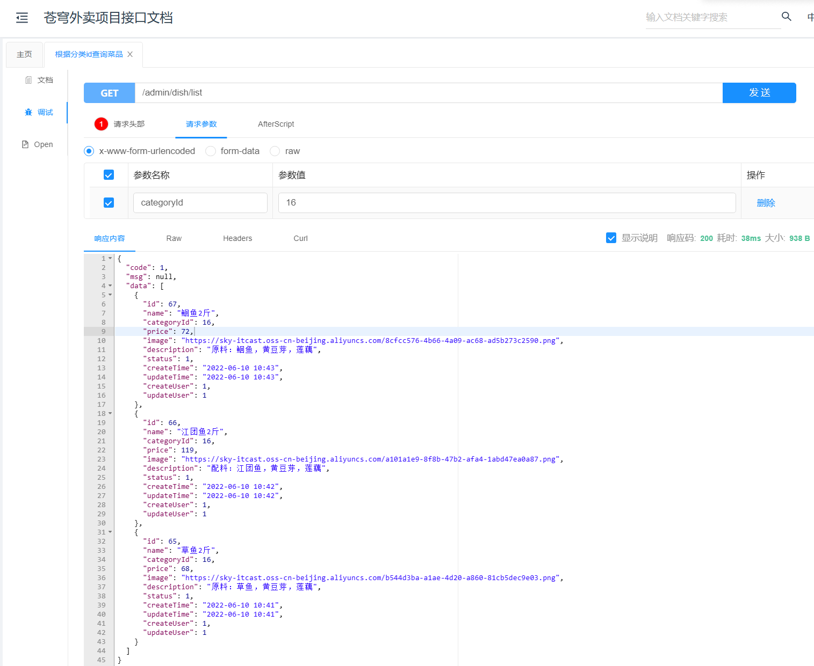

### 3.2、前后端联调测试

进入套餐管理，点击新建套餐：

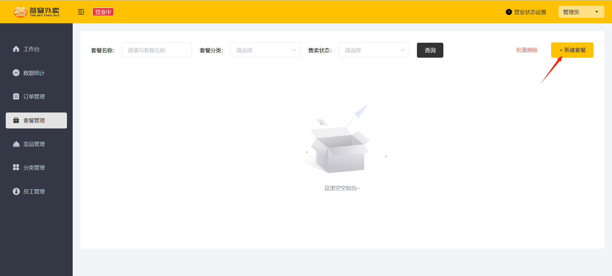

点击添加菜品：

选择好菜品后，填写套餐基本信息：

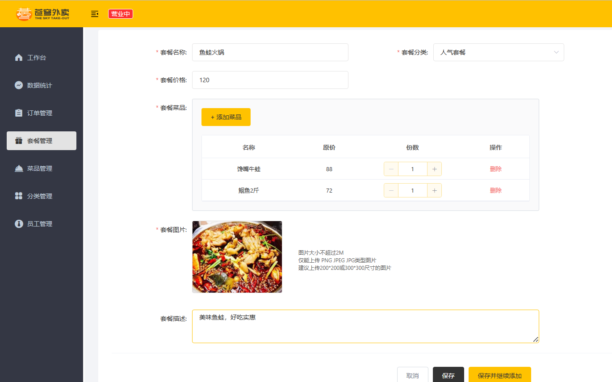

点击保存后，由于还没实现分页查询功能，所以会报错，但会看到添加成功的弹窗提示

# 二、套餐分页查询

## 1、需求分析和设计

产品原型：

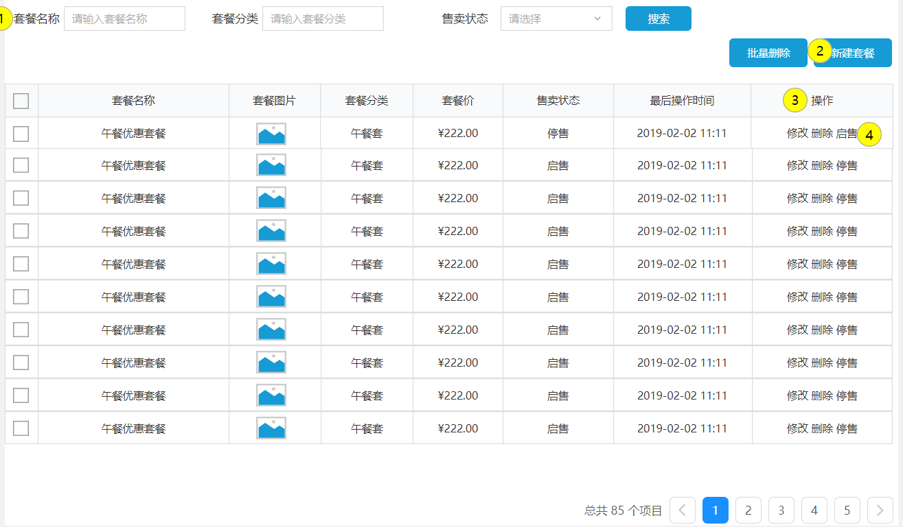

业务规则：

- 根据页码进行分页展示
- 每页展示 10 条数据
- 可以根据需要，按照套餐名称、分类、售卖状态进行查询

接口设计：

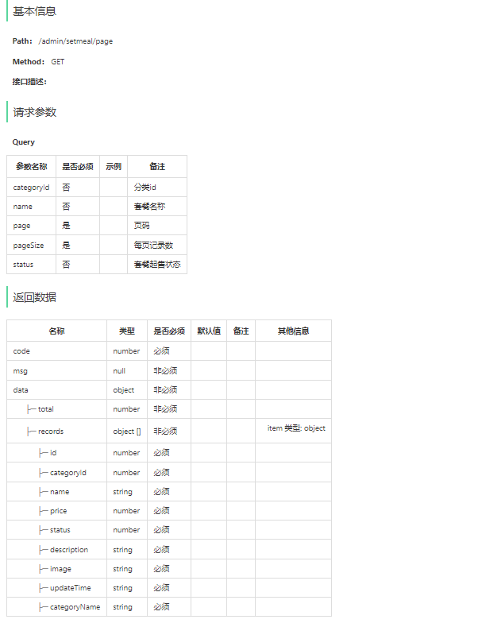

## 2、代码实现

**1）SetmealController**

~~~java
/**
 * 分页查询
 * @param setmealPageQueryDTO
 * @return
 */
@GetMapping("/page")
@ApiOperation("分页查询")
public Result<PageResult> page(SetmealPageQueryDTO setmealPageQueryDTO) {
    log.info("分页查询：{}",setmealPageQueryDTO);
    PageResult pageResult = setmealService.pageQuery(setmealPageQueryDTO);
    return Result.success(pageResult);
}
~~~

**2）SetmealService**

~~~java
/**
 * 分页查询
 * @param setmealPageQueryDTO
 * @return
 */
PageResult pageQuery(SetmealPageQueryDTO setmealPageQueryDTO);
~~~

**3）SetmealServiceImpl**

~~~java
/**
 * 分页查询
 * @param setmealPageQueryDTO
 * @return
 */
public PageResult pageQuery(SetmealPageQueryDTO setmealPageQueryDTO) {
    int pageNum = setmealPageQueryDTO.getPage();
    int pageSize = setmealPageQueryDTO.getPageSize();

    PageHelper.startPage(pageNum, pageSize);
    Page<SetmealVO> page = setmealMapper.pageQuery(setmealPageQueryDTO);
    return new PageResult(page.getTotal(), page.getResult());
}
~~~

**4）SetmealMapper**

~~~java
/**
 * 分页查询
 * @param setmealPageQueryDTO
 * @return
 */
Page<SetmealVO> pageQuery(SetmealPageQueryDTO setmealPageQueryDTO);
~~~

**5）SetmealMapper.xml**

~~~xml
<select id="pageQuery" resultType="com.sky.vo.SetmealVO">
    select s.*,c.name categoryName
    from setmeal s left join category c
    on s.category_id = c.id
    <where>
        <if test="name != null">
            and s.name like concat('%',#{name},'%')
        </if>
        <if test="status != null">
            and s.status = #{status}
        </if>
        <if test="categoryId != null">
            and s.category_id = #{categoryId}
        </if>
    </where>
    order by s.create_time desc
</select>
~~~

## 3、功能测试

接口文档测试：

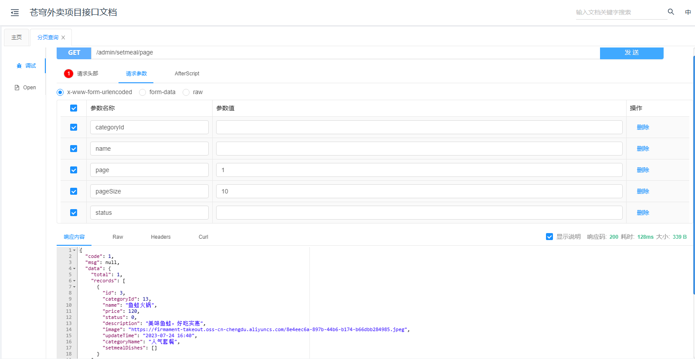

前后端联调测试：

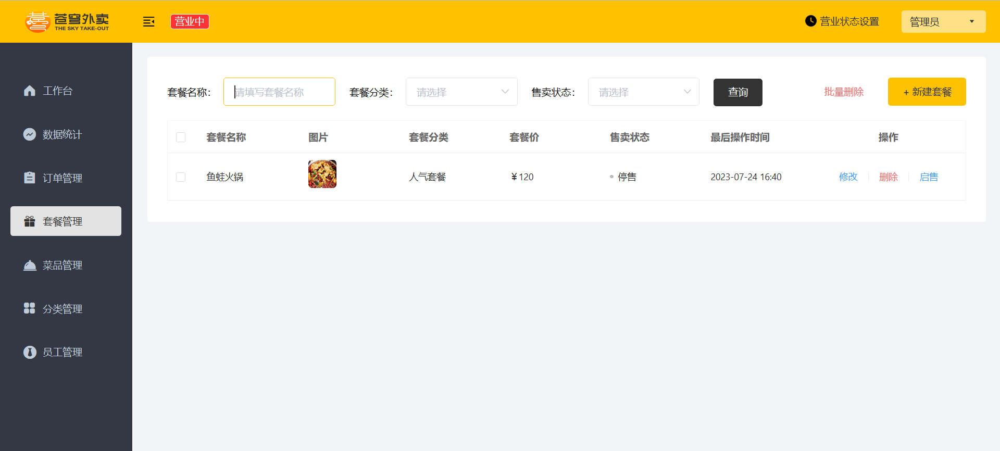

# 三、删除套餐

## 1、需求分析和设计

产品原型：

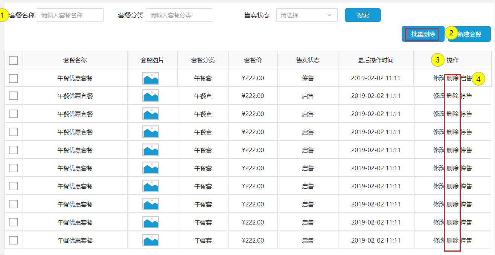

业务规则：

- 可以一次删除一个套餐，也可以批量删除套餐
- 起售中的套餐不能删除

接口设计：

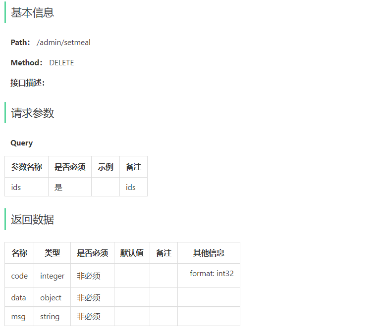

## 2、代码实现

**1）SetmealController**

~~~java
/**
 * 批量删除套餐
 * @param ids
 * @return
 */
@DeleteMapping
@ApiOperation("批量删除套餐")
public Result delete(@RequestParam List<Long> ids){
    log.info("批量删除套餐：{}",ids);
    setmealService.deleteBatch(ids);
    return Result.success();
}
~~~

**2）SetmealService**

~~~java
/**
 * 批量删除套餐
 * @param ids
 */
void deleteBatch(List<Long> ids);
~~~

**3）SetmealServiceImpl**

~~~java
/**
 * 批量删除套餐
 * @param ids
 */
@Transactional
public void deleteBatch(List<Long> ids) {
    ids.forEach(id -> {
        Setmeal setmeal = setmealMapper.getById(id);
        if(StatusConstant.ENABLE == setmeal.getStatus()){
            //起售中的套餐不能删除
            throw new DeletionNotAllowedException(MessageConstant.SETMEAL_ON_SALE);
        }
    });

    ids.forEach(setmealId -> {
        //删除套餐表中的数据
        setmealMapper.deleteById(setmealId);
        //删除套餐菜品关系表中的数据
        setmealDishMapper.deleteBySetmealId(setmealId);
    });
}
~~~

**4）SetmealMapper**

~~~java
/**
 * 根据id查询套餐
 * @param id
 * @return
 */
@Select("select * from setmeal where id = #{id}")
Setmeal getById(Long id);

/**
 * 根据id删除套餐
 * @param setmealId
 */
@Delete("delete from setmeal where id = #{id}")
void deleteById(Long setmealId);
~~~

**5）SetmealDishMapper**

~~~java
/**
 * 根据套餐id删除套餐和菜品的关联关系
 * @param setmealId
 */
@Delete("delete from setmeal_dish where setmeal_id = #{setmealId}")
void deleteBySetmealId(Long setmealId);
~~~

## 3、功能测试

进入套餐管理，点击删除按钮

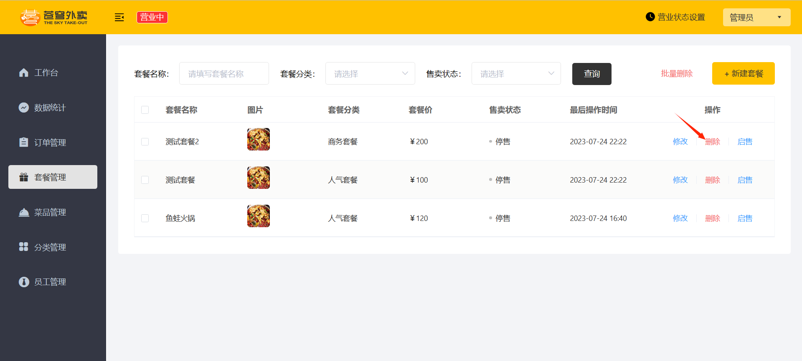

页面提示删除成功

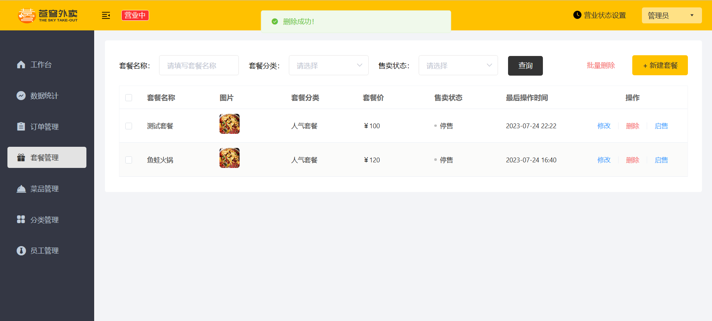

# 四、修改套餐

## 1、需求分析和设计

产品原型：

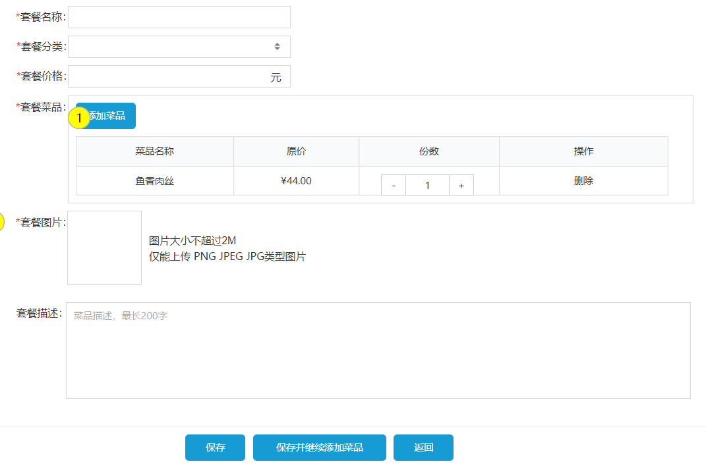

接口设计（共涉及到 5 个接口）：

- 根据 id 查询套餐
- 根据类型查询分类（已完成）
- 根据分类 id 查询菜品（已完成）
- 图片上传（已完成）
- 修改套餐

**1.根据 id 查询套餐**

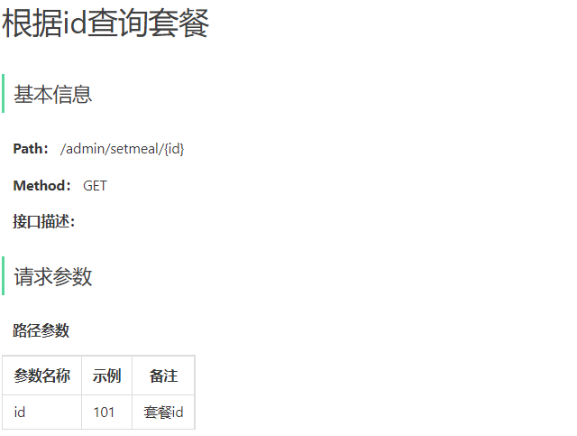

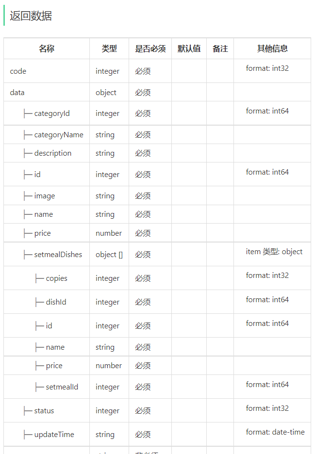

**2.修改套餐**

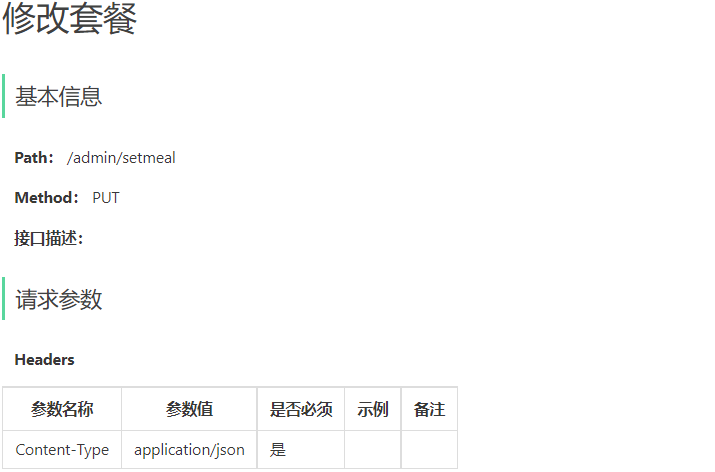

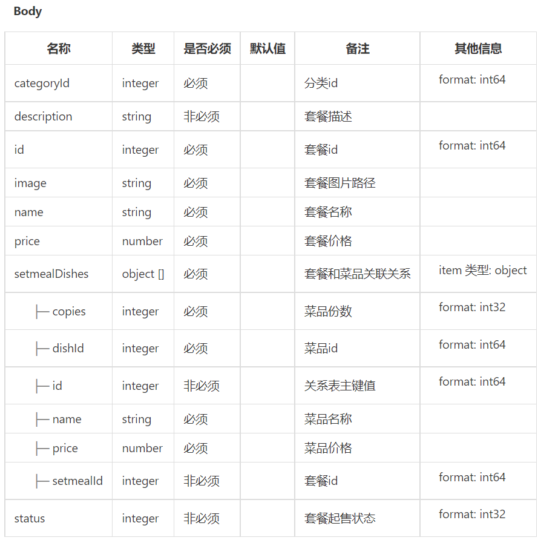

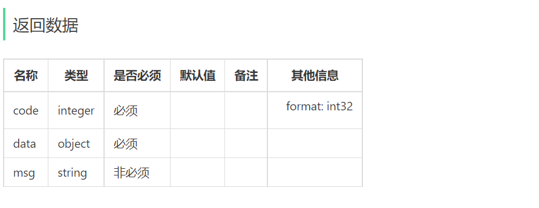

## 2、代码实现

**1）SetmealController**

~~~java
/**
 * 根据id查询套餐，用于修改页面回显数据
 * @param id
 * @return
 */
@GetMapping("/{id}")
@ApiOperation("根据id查询套餐")
public Result<SetmealVO> getById(@PathVariable Long id) {
    log.info("根据id查询套餐：{}",id);
    SetmealVO setmealVO = setmealService.getByIdWithDish(id);
    return Result.success(setmealVO);
}

/**
 * 修改套餐
 * @param setmealDTO
 * @return
 */
@PutMapping
@ApiOperation("修改套餐")
public Result update(@RequestBody SetmealDTO setmealDTO) {
    log.info("修改套餐：{}",setmealDTO);
    setmealService.update(setmealDTO);
    return Result.success();
}
~~~

**2）SetmealService**

~~~java
/**
 * 根据id查询套餐和关联的菜品数据
 * @param id
 * @return
 */
SetmealVO getByIdWithDish(Long id);

/**
 * 修改套餐
 * @param setmealDTO
 */
void update(SetmealDTO setmealDTO);
~~~

**3）SetmealServiceImpl**

~~~java
/**
 * 根据id查询套餐和套餐菜品关系
 * @param id
 * @return
 */
@Override
public SetmealVO getByIdWithDish(Long id) {
    Setmeal setmeal = setmealMapper.getById(id);
    List<SetmealDish> setmealDishes = setmealDishMapper.getBySetmealId(id);

    SetmealVO setmealVO = new SetmealVO();
    BeanUtils.copyProperties(setmeal, setmealVO);
    setmealVO.setSetmealDishes(setmealDishes);
    
    return setmealVO;
}

/**
 * 修改套餐
 * @param setmealDTO
 */
@Override
@Transactional
public void update(SetmealDTO setmealDTO) {
    Setmeal setmeal = new Setmeal();
    BeanUtils.copyProperties(setmealDTO, setmeal);

    //1、修改套餐表，执行update
    setmealMapper.update(setmeal);

    //套餐id
    Long setmealId = setmealDTO.getId();

    //2、删除套餐和菜品的关联关系，操作setmeal_dish表，执行delete
    setmealDishMapper.deleteBySetmealId(setmealId);

    List<SetmealDish> setmealDishes = setmealDTO.getSetmealDishes();
    setmealDishes.forEach(setmealDish -> {
        setmealDish.setSetmealId(setmealId);
    });
    //3、重新插入套餐和菜品的关联关系，操作setmeal_dish表，执行insert
    setmealDishMapper.insertBatch(setmealDishes);
}
~~~

**4）SetmealDishMapper**

~~~java
/**
 * 根据套餐id查询套餐和菜品的关联关系
 * @param setmealId
 * @return
 */
@Select("select * from setmeal_dish where setmeal_id = #{setmealId}")
List<SetmealDish> getBySetmealId(Long setmealId);
~~~

## 3、功能测试

进入套餐管理，选择一个套餐点击修改：

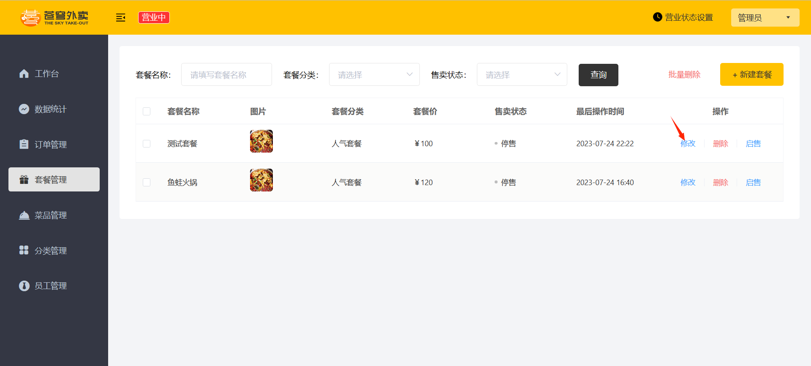

将价格改为 150：

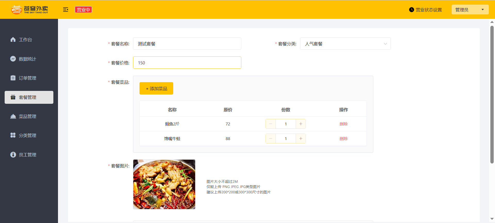

点击保存按钮后可看到已经修改成功：

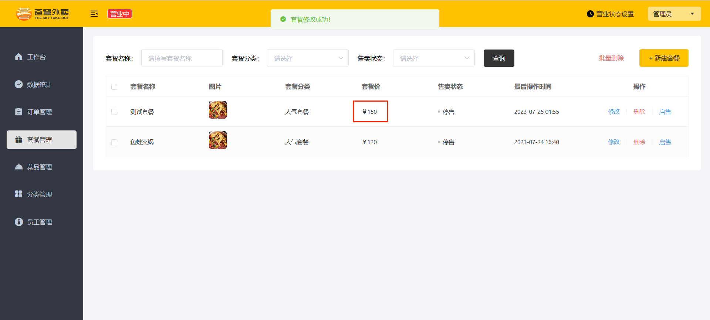

# 五、起售停售套餐

### 5.1 需求分析和设计

产品原型：

业务规则：

- 可以对状态为起售的套餐进行停售操作，可以对状态为停售的套餐进行起售操作
- 起售的套餐可以展示在用户端，停售的套餐不能展示在用户端
- 起售套餐时，如果套餐内包含停售的菜品，则不能起售

接口设计：

### 5.2 代码实现

#### 5.2.1 SetmealController

~~~java
/**
     * 套餐起售停售
     * @param status
     * @param id
     * @return
*/
@PostMapping("/status/{status}")
@ApiOperation("套餐起售停售")
public Result startOrStop(@PathVariable Integer status, Long id) {
    setmealService.startOrStop(status, id);
    return Result.success();
}
~~~

#### 5.2.2 SetmealService

~~~java
/**
     * 套餐起售、停售
     * @param status
     * @param id
*/
void startOrStop(Integer status, Long id);
~~~

#### 5.2.3 SetmealServiceImpl

~~~java
/**
     * 套餐起售、停售
     * @param status
     * @param id
*/
public void startOrStop(Integer status, Long id) {
    //起售套餐时，判断套餐内是否有停售菜品，有停售菜品提示"套餐内包含未启售菜品，无法启售"
    if(status == StatusConstant.ENABLE){
        //select a.* from dish a left join setmeal_dish b on a.id = b.dish_id where b.setmeal_id = ?
        List<Dish> dishList = dishMapper.getBySetmealId(id);
        if(dishList != null && dishList.size() > 0){
            dishList.forEach(dish -> {
                if(StatusConstant.DISABLE == dish.getStatus()){
                    throw new SetmealEnableFailedException(MessageConstant.SETMEAL_ENABLE_FAILED);
                }
            });
        }
    }

    Setmeal setmeal = Setmeal.builder()
        .id(id)
        .status(status)
        .build();
    setmealMapper.update(setmeal);
}
~~~

#### 5.2.4 DishMapper

~~~java
/**
     * 根据套餐id查询菜品
     * @param setmealId
     * @return
*/
@Select("select a.* from dish a left join setmeal_dish b on a.id = b.dish_id where b.setmeal_id = #{setmealId}")
List<Dish> getBySetmealId(Long setmealId);
~~~

### 5.3 功能测试

略