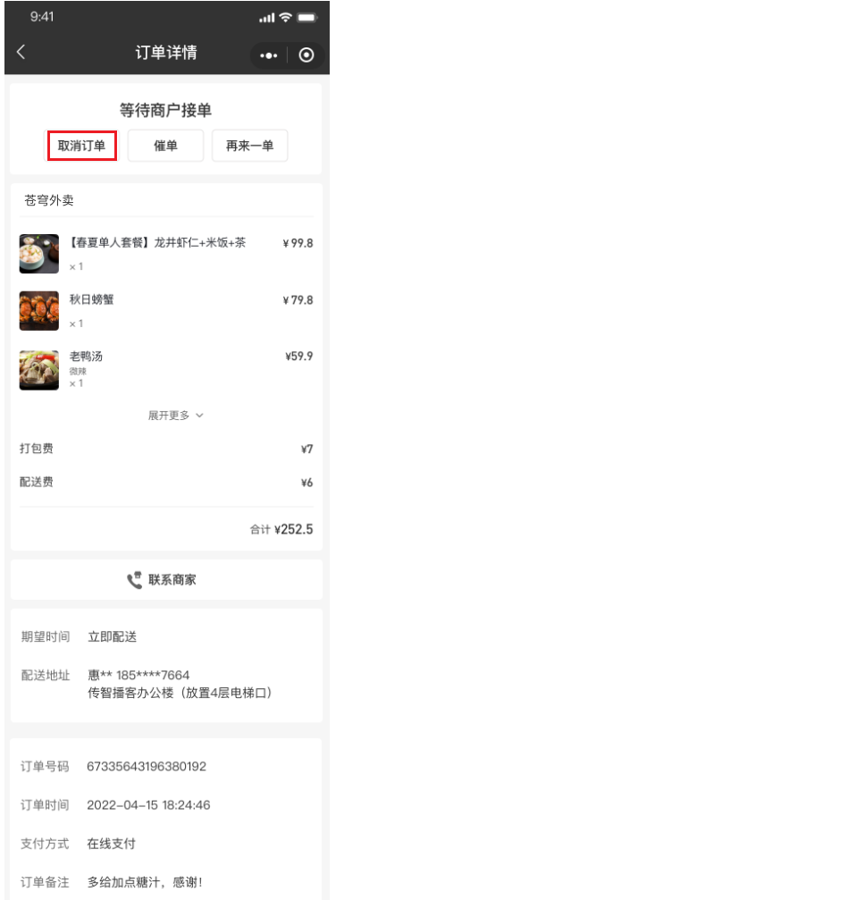
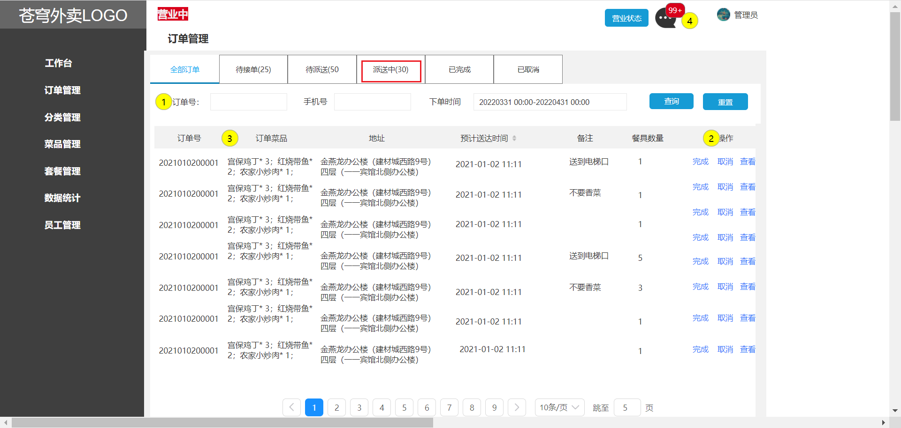
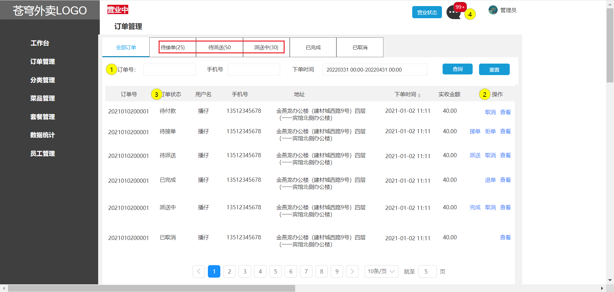
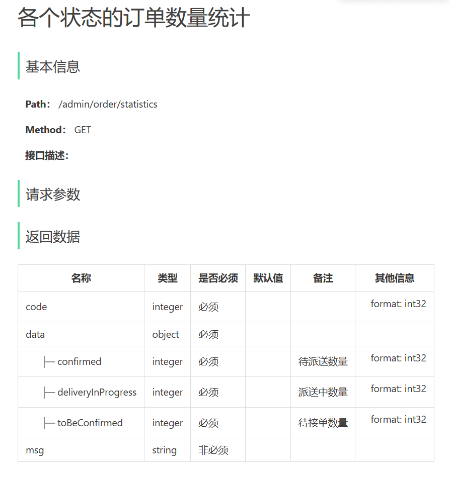
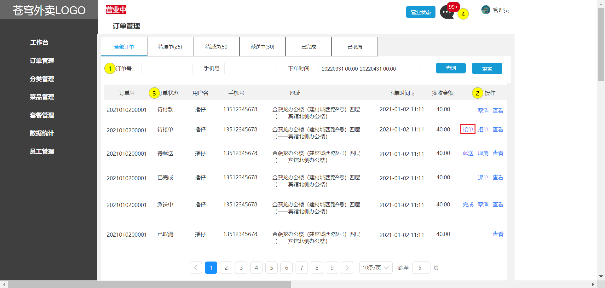
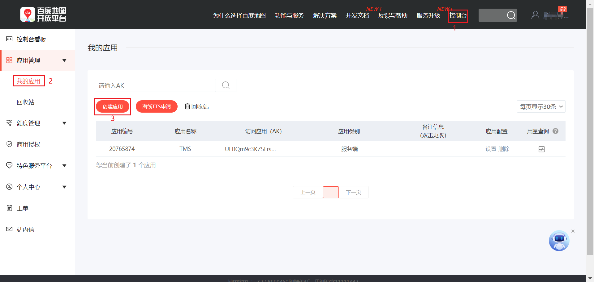
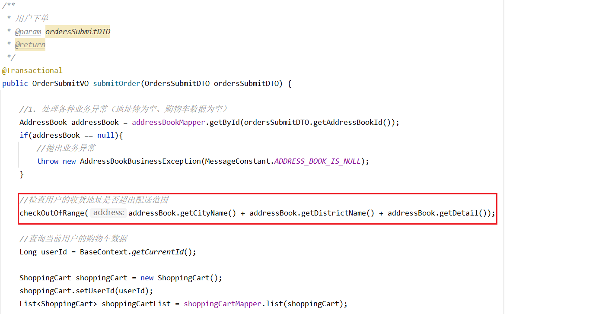

# 一、用户端历史订单模块

## 1、查询历史订单

### 1.1、需求分析和设计

产品原型：

业务规则

- 分页查询历史订单
- 可以根据订单状态查询
- 展示订单数据时，需要展示的数据包括：下单时间、订单状态、订单金额、订单明细（商品名称、图片）

接口设计：

### 1.2、代码实现

user/OrderController

~~~java
/**
 * 历史订单查询
 * @param page
 * @param pageSize
 * @param status：订单状态 1待付款 2待接单 3已接单 4派送中 5已完成 6已取消
 * @return
 */
@GetMapping("/historyOrders")
@ApiOperation("历史订单查询")
public Result<PageResult> page(int page, int pageSize, Integer status) {
    log.info("历史订单查询");
    PageResult pageResult = orderService.pageQuery4User(page, pageSize, status);
    return Result.success(pageResult);
}
~~~

OrderService

~~~java
/**
 * 用户端订单分页查询
 * @param page
 * @param pageSize
 * @param status
 * @return
 */
PageResult pageQuery4User(int page, int pageSize, Integer status);
~~~

OrderServiceImpl

~~~java
/**
 * 用户端订单分页查询
 * @param pageNum
 * @param pageSize
 * @param status
 * @return
 */
public PageResult pageQuery4User(int pageNum, int pageSize, Integer status) {
    // 设置分页
    PageHelper.startPage(pageNum, pageSize);

    OrdersPageQueryDTO ordersPageQueryDTO = new OrdersPageQueryDTO();
    ordersPageQueryDTO.setUserId(BaseContext.getCurrentId());
    ordersPageQueryDTO.setStatus(status);

    // 分页条件查询
    Page<Orders> page = orderMapper.pageQuery(ordersPageQueryDTO);

    List<OrderVO> list = new ArrayList();

    // 查询出订单明细，并封装入OrderVO进行响应
    if (page != null && page.getTotal() > 0) {
        for (Orders orders : page) {
            Long orderId = orders.getId();// 订单id

            // 查询订单明细
            List<OrderDetail> orderDetails = orderDetailMapper.getByOrderId(orderId);

            OrderVO orderVO = new OrderVO();
            BeanUtils.copyProperties(orders, orderVO);
            orderVO.setOrderDetailList(orderDetails);

            list.add(orderVO);
        }
    }
    return new PageResult(page.getTotal(), list);
}
~~~

OrderMapper

~~~java
/**
 * 分页条件查询并按下单时间排序
 * @param ordersPageQueryDTO
 */
Page<Orders> pageQuery(OrdersPageQueryDTO ordersPageQueryDTO);
~~~

OrderMapper.xml

~~~xml
<select id="pageQuery" resultType="Orders">
    select * from orders
    <where>
        <if test="number != null and number!=''">
            and number like concat('%',#{number},'%')
        </if>
        <if test="phone != null and phone != ''">
            and phone like concat('%',#{phone},'%')
        </if>
        <if test="userId != null">
            and user_id = #{userId}
        </if>
        <if test="status != null">
            and status = #{status}
        </if>
        <if test="beginTime != null">
            and order_time &gt;= #{beginTime}
        </if>
        <if test="endTime != null">
            and order_time &lt;= #{endTime}
        </if>
    </where>
    order by order_time desc
</select>
~~~

OrderDetailMapper

~~~java
/**
 * 根据订单id查询订单明细
 * @param orderId
 * @return
 */
@Select("select * from order_detail where order_id = #{orderId}")
List<OrderDetail> getByOrderId(Long orderId);
~~~

### 1.3、功能测试

## 2、查询订单详情

### 2.1、需求分析和设计

产品原型：

接口设计：

### 2.2、代码实现

user/OrderController

~~~java
/**
 * 查询订单详情
 * @param id
 * @return
 */
@GetMapping("/orderDetail/{id}")
@ApiOperation("查询订单详情")
public Result<OrderVO> details(@PathVariable("id") Long id) {
    OrderVO orderVO = orderService.details(id);
    return Result.success(orderVO);
}
~~~

OrderService

~~~java
/**
 * 查询订单详情
 * @param id
 * @return
 */
OrderVO details(Long id);
~~~

OrderServiceImpl

~~~java
/**
 * 查询订单详情
 * @param id
 * @return
 */
public OrderVO details(Long id) {
    // 根据id查询订单
    Orders orders = orderMapper.getById(id);

    // 查询该订单对应的菜品/套餐明细
    List<OrderDetail> orderDetailList = orderDetailMapper.getByOrderId(orders.getId());

    // 将该订单及其详情封装到OrderVO并返回
    OrderVO orderVO = new OrderVO();
    BeanUtils.copyProperties(orders, orderVO);
    orderVO.setOrderDetailList(orderDetailList);

    return orderVO;
}
~~~

OrderMapper

~~~java
/**
 * 根据id查询订单
 * @param id
 */
@Select("select * from orders where id=#{id}")
Orders getById(Long id);
~~~

### 2.3、功能测试

## 3、取消订单

### 3.1、需求分析和设计

产品原型：

业务规则：

- 待支付和待接单状态下，用户可直接取消订单
- 商家已接单状态下，用户取消订单需电话沟通商家
- 派送中状态下，用户取消订单需电话沟通商家
- 如果在待接单状态下取消订单，需要给用户退款
- 取消订单后需要将订单状态修改为“已取消”

接口设计：

### 3.2、代码实现

user/OrderController

~~~java
/**
 * 用户取消订单
 * @return
 */
@PutMapping("/cancel/{id}")
@ApiOperation("取消订单")
public Result cancel(@PathVariable("id") Long id) throws Exception {
    orderService.userCancelById(id);
    return Result.success();
}
~~~

OrderService

~~~java
/**
 * 用户取消订单
 * @param id
 */
void userCancelById(Long id) throws Exception;
~~~

OrderServiceImpl

~~~java
/**
 * 用户取消订单
 * @param id
 */
public void userCancelById(Long id) throws Exception {
    // 根据id查询订单
    Orders ordersDB = orderMapper.getById(id);

    // 校验订单是否存在
    if (ordersDB == null) {
        throw new OrderBusinessException(MessageConstant.ORDER_NOT_FOUND);
    }

    //订单状态 1待付款 2待接单 3已接单 4派送中 5已完成 6已取消
    if (ordersDB.getStatus() > 2) {
        throw new OrderBusinessException(MessageConstant.ORDER_STATUS_ERROR);
    }

    Orders orders = new Orders();
    orders.setId(ordersDB.getId());

    // 订单处于待接单状态下取消，需要进行退款
    if (ordersDB.getStatus().equals(Orders.TO_BE_CONFIRMED)) {
        //调用微信支付退款接口
        weChatPayUtil.refund(
            ordersDB.getNumber(), //商户订单号
            ordersDB.getNumber(), //商户退款单号
            new BigDecimal(0.01),//退款金额，单位 元
            new BigDecimal(0.01));//原订单金额

        //支付状态修改为 退款
        orders.setPayStatus(Orders.REFUND);
    }

    // 更新订单状态、取消原因、取消时间
    orders.setStatus(Orders.CANCELLED);
    orders.setCancelReason("用户取消");
    orders.setCancelTime(LocalDateTime.now());
    orderMapper.update(orders);
}
~~~

### 3.3、功能测试

点击取消订单按钮，出现弹窗提示订单已取消

点击确认后，可看到订单状态已变为“已取消”

## 4、再来一单

### 4.1、需求分析和设计

产品原型：

接口设计：

业务规则：

- 再来一单就是将原订单中的商品重新加入到购物车中

### 4.2、代码实现

user/OrderController

~~~java
/**
 * 再来一单
 * @param id
 * @return
 */
@PostMapping("/repetition/{id}")
@ApiOperation("再来一单")
public Result repetition(@PathVariable Long id) {
    orderService.repetition(id);
    return Result.success();
}
~~~

OrderService

~~~java
/**
 * 再来一单
 * @param id
 */
void repetition(Long id);
~~~

OrderServiceImpl

~~~java
/**
 * 再来一单
 * @param id
 */
public void repetition(Long id) {
    // 查询当前用户id
    Long userId = BaseContext.getCurrentId();

    // 根据订单id查询当前订单详情
    List<OrderDetail> orderDetailList = orderDetailMapper.getByOrderId(id);

    // 将订单详情对象转换为购物车对象
    List<ShoppingCart> shoppingCartList = orderDetailList.stream().map(x -> {
        ShoppingCart shoppingCart = new ShoppingCart();

        // 将原订单详情里面的菜品信息重新复制到购物车对象中
        BeanUtils.copyProperties(x, shoppingCart, "id");
        shoppingCart.setUserId(userId);
        shoppingCart.setCreateTime(LocalDateTime.now());

        return shoppingCart;
    }).collect(Collectors.toList());

    // 将购物车对象批量添加到数据库
    shoppingCartMapper.insertBatch(shoppingCartList);
}
~~~

ShoppingCartMapper

~~~java
/**
 * 批量插入购物车数据
 * @param shoppingCartList
 */
void insertBatch(List<ShoppingCart> shoppingCartList);
~~~

ShoppingCartMapper.xml

~~~xml
<insert id="insertBatch" parameterType="list">
    insert into shopping_cart
    (name, image, user_id, dish_id, setmeal_id, dish_flavor, number, amount, create_time)
    values
    <foreach collection="shoppingCartList" item="sc" separator=",">
        (#{sc.name},#{sc.image},#{sc.userId},#{sc.dishId},#{sc.setmealId},#{sc.dishFlavor},#{sc.number},#{sc.amount},#{sc.createTime})
    </foreach>
</insert>
~~~

### 4.3、功能测试

点击再来一单按钮后，该订单中的所有商品再次被添加到购物车中

# 二、商家端订单管理模块

## 1、订单搜索

### 1.1、需求分析和设计

产品原型：

业务规则：

- 输入订单号 / 手机号进行搜索，支持模糊搜索
- 根据订单状态进行筛选
- 下单时间进行时间筛选
- 搜索内容为空，提示未找到相关订单
- 搜索结果页，展示包含搜索关键词的内容
- 分页展示搜索到的订单数据

接口设计：

### 1.2、代码实现

admin / OrderController：在 admin 包下创建 OrderController

~~~java
/**
 * 订单管理
 */
@RestController("adminOrderController")
@RequestMapping("/admin/order")
@Slf4j
@Api(tags = "订单管理接口")
public class OrderController {

    @Autowired
    private OrderService orderService;

    /**
     * 订单搜索
     * @param ordersPageQueryDTO
     * @return
     */
    @GetMapping("/conditionSearch")
    @ApiOperation("订单搜索")
    public Result<PageResult> conditionSearch(OrdersPageQueryDTO ordersPageQueryDTO) {
        PageResult pageResult = orderService.conditionSearch(ordersPageQueryDTO);
        return Result.success(pageResult);
    }
}
~~~

OrderService

~~~java
/**
 * 条件搜索订单
 * @param ordersPageQueryDTO
 * @return
 */
PageResult conditionSearch(OrdersPageQueryDTO ordersPageQueryDTO);
~~~

OrderServiceImpl

~~~java
/**
 * 订单搜索
 * @param ordersPageQueryDTO
 * @return
 */
public PageResult conditionSearch(OrdersPageQueryDTO ordersPageQueryDTO) {
    PageHelper.startPage(ordersPageQueryDTO.getPage(), ordersPageQueryDTO.getPageSize());

    Page<Orders> page = orderMapper.pageQuery(ordersPageQueryDTO);

    // 部分订单状态，需要额外返回订单菜品信息，将Orders转化为OrderVO
    List<OrderVO> orderVOList = getOrderVOList(page);

    return new PageResult(page.getTotal(), orderVOList);
}

private List<OrderVO> getOrderVOList(Page<Orders> page) {
    // 需要返回订单菜品信息，自定义OrderVO响应结果
    List<OrderVO> orderVOList = new ArrayList<>();

    List<Orders> ordersList = page.getResult();
    if (!CollectionUtils.isEmpty(ordersList)) {
        for (Orders orders : ordersList) {
            // 将共同字段复制到OrderVO
            OrderVO orderVO = new OrderVO();
            BeanUtils.copyProperties(orders, orderVO);
            String orderDishes = getOrderDishesStr(orders);

            // 将订单菜品信息封装到orderVO中，并添加到orderVOList
            orderVO.setOrderDishes(orderDishes);
            orderVOList.add(orderVO);
        }
    }
    return orderVOList;
}

/**
 * 根据订单id获取菜品信息字符串
 * @param orders
 * @return
 */
private String getOrderDishesStr(Orders orders) {
    // 查询订单菜品详情信息（订单中的菜品和数量）
    List<OrderDetail> orderDetailList = orderDetailMapper.getByOrderId(orders.getId());

    // 将每一条订单菜品信息拼接为字符串（格式：宫保鸡丁*3；）
    List<String> orderDishList = orderDetailList.stream().map(x -> {
        String orderDish = x.getName() + "*" + x.getNumber() + ";";
        return orderDish;
    }).collect(Collectors.toList());

    // 将该订单对应的所有菜品信息拼接在一起
    return String.join("", orderDishList);
}
~~~

### 1.3、功能测试

点击订单管理默认查询所有订单：

输入订单号查询：

根据下单时间进行筛选：

## 2、各个状态的订单数量统计

### 2.1、需求分析和设计

产品原型：

接口设计：

### 2.2、代码实现

admin/OrderController

~~~java
/**
 * 各个状态的订单数量统计
 * @return
 */
@GetMapping("/statistics")
@ApiOperation("各个状态的订单数量统计")
public Result<OrderStatisticsVO> statistics() {
    OrderStatisticsVO orderStatisticsVO = orderService.statistics();
    return Result.success(orderStatisticsVO);
}
~~~

OrderService

~~~java
/**
 * 各个状态的订单数量统计
 * @return
 */
OrderStatisticsVO statistics();
~~~

OrderServiceImpl

~~~java
/**
 * 各个状态的订单数量统计
 * @return
 */
public OrderStatisticsVO statistics() {
    // 根据状态，分别查询出待接单、待派送、派送中的订单数量
    Integer toBeConfirmed = orderMapper.countStatus(Orders.TO_BE_CONFIRMED);
    Integer confirmed = orderMapper.countStatus(Orders.CONFIRMED);
    Integer deliveryInProgress = orderMapper.countStatus(Orders.DELIVERY_IN_PROGRESS);

    // 将查询出的数据封装到orderStatisticsVO中响应
    OrderStatisticsVO orderStatisticsVO = new OrderStatisticsVO();
    orderStatisticsVO.setToBeConfirmed(toBeConfirmed);
    orderStatisticsVO.setConfirmed(confirmed);
    orderStatisticsVO.setDeliveryInProgress(deliveryInProgress);
    return orderStatisticsVO;
}
~~~

OrderMapper

~~~java
/**
 * 根据状态统计订单数量
 * @param status
 */
@Select("select count(id) from orders where status = #{status}")
Integer countStatus(Integer status);
~~~

### 2.3、功能测试

## 3、查询订单详情

### 3.1、需求分析和设计

产品原型：

业务规则：

- 订单详情页面需要展示订单基本信息（状态、订单号、下单时间、收货人、电话、收货地址、金额等）
- 订单详情页面需要展示订单明细数据（商品名称、数量、单价）

接口设计：

### 3.2、代码实现

admin/OrderController

~~~java
/**
 * 订单详情
 * @param id
 * @return
 */
@GetMapping("/details/{id}")
@ApiOperation("查询订单详情")
public Result<OrderVO> details(@PathVariable("id") Long id) {
    OrderVO orderVO = orderService.details(id);
    return Result.success(orderVO);
}
~~~

### 3.3、功能测试

## 4、接单

### 4.1、需求分析和设计

产品原型：

业务规则：

- 商家接单其实就是将订单的状态修改为“已接单”

接口设计：

### 4.2、代码实现

admin/OrderController

~~~java
/**
 * 接单
 * @return
 */
@PutMapping("/confirm")
@ApiOperation("接单")
public Result confirm(@RequestBody OrdersConfirmDTO ordersConfirmDTO) {
    orderService.confirm(ordersConfirmDTO);
    return Result.success();
}
~~~

OrderService

~~~java
/**
 * 接单
 * @param ordersConfirmDTO
 */
void confirm(OrdersConfirmDTO ordersConfirmDTO);
~~~

OrderServiceImpl

~~~java
/**
 * 接单
 * @param ordersConfirmDTO
 */
public void confirm(OrdersConfirmDTO ordersConfirmDTO) {
    Orders orders = Orders.builder()
        .id(ordersConfirmDTO.getId())
        .status(Orders.CONFIRMED)
        .build();

    orderMapper.update(orders);
}
~~~

### 4.3、功能测试

点击接单按钮后，该订单的状态变为 “待派送” 

## 5、拒单

### 5.1、需求分析和设计

产品原型：

业务规则：

- 商家拒单其实就是将订单状态修改为“已取消”
- 只有订单处于“待接单”状态时可以执行拒单操作
- 商家拒单时需要指定拒单原因
- 商家拒单时，如果用户已经完成了支付，需要为用户退款

接口设计：

### 5.2、代码实现

admin/OrderController

~~~java
/**
 * 拒单
 * @return
 */
@PutMapping("/rejection")
@ApiOperation("拒单")
public Result rejection(@RequestBody OrdersRejectionDTO ordersRejectionDTO) throws Exception {
    orderService.rejection(ordersRejectionDTO);
    return Result.success();
}
~~~

OrderService

~~~java
/**
 * 拒单
 * @param ordersRejectionDTO
 */
void rejection(OrdersRejectionDTO ordersRejectionDTO) throws Exception;
~~~

OrderServiceImpl

~~~java
/**
 * 拒单
 * @param ordersRejectionDTO
 */
public void rejection(OrdersRejectionDTO ordersRejectionDTO) throws Exception {
    // 根据id查询订单
    Orders ordersDB = orderMapper.getById(ordersRejectionDTO.getId());

    // 订单只有存在且状态为2（待接单）才可以拒单
    if (ordersDB == null || !ordersDB.getStatus().equals(Orders.TO_BE_CONFIRMED)) {
        throw new OrderBusinessException(MessageConstant.ORDER_STATUS_ERROR);
    }

    //支付状态
    Integer payStatus = ordersDB.getPayStatus();
    if (payStatus == Orders.PAID) {
        //用户已支付，需要退款
        String refund = weChatPayUtil.refund(
            ordersDB.getNumber(),
            ordersDB.getNumber(),
            new BigDecimal(0.01),
            new BigDecimal(0.01));
        log.info("申请退款：{}", refund);
    }

    // 拒单需要退款，根据订单id更新订单状态、拒单原因、取消时间
    Orders orders = new Orders();
    orders.setId(ordersDB.getId());
    orders.setStatus(Orders.CANCELLED);
    orders.setRejectionReason(ordersRejectionDTO.getRejectionReason());
    orders.setCancelTime(LocalDateTime.now());

    orderMapper.update(orders);
}
~~~

### 5.3、功能测试

点击拒单按钮后，可选择拒单原因，点击确定后，该订单的状态变为已取消

## 6、取消订单

### 6.1、需求分析和设计

产品原型：

业务规则：

- 取消订单其实就是将订单状态修改为“已取消”
- 商家取消订单时需要指定取消原因
- 商家取消订单时，如果用户已经完成了支付，需要为用户退款

接口设计：

### 6.2、代码实现

admin/OrderController

~~~java
/**
 * 取消订单
 * @return
 */
@PutMapping("/cancel")
@ApiOperation("取消订单")
public Result cancel(@RequestBody OrdersCancelDTO ordersCancelDTO) throws Exception {
    orderService.cancel(ordersCancelDTO);
    return Result.success();
}
~~~

OrderService

~~~java
/**
 * 商家取消订单
 * @param ordersCancelDTO
 */
void cancel(OrdersCancelDTO ordersCancelDTO) throws Exception;
~~~

OrderServiceImpl

~~~java
/**
 * 取消订单
 * @param ordersCancelDTO
 */
public void cancel(OrdersCancelDTO ordersCancelDTO) throws Exception {
    // 根据id查询订单
    Orders ordersDB = orderMapper.getById(ordersCancelDTO.getId());

    //支付状态
    Integer payStatus = ordersDB.getPayStatus();
    if (payStatus == 1) {
        //用户已支付，需要退款
        String refund = weChatPayUtil.refund(
            ordersDB.getNumber(),
            ordersDB.getNumber(),
            new BigDecimal(0.01),
            new BigDecimal(0.01));
        log.info("申请退款：{}", refund);
    }

    // 管理端取消订单需要退款，根据订单id更新订单状态、取消原因、取消时间
    Orders orders = new Orders();
    orders.setId(ordersCancelDTO.getId());
    orders.setStatus(Orders.CANCELLED);
    orders.setCancelReason(ordersCancelDTO.getCancelReason());
    orders.setCancelTime(LocalDateTime.now());
    orderMapper.update(orders);
}
~~~

### 6.3、功能测试

点击取消按钮，可选择取消原因，点击确定后，该订单的状态变为已取消

## 7、派送订单

### 7.1、需求分析和设计

产品原型：

业务规则：

- 派送订单其实就是将订单状态修改为“派送中”
- 只有状态为“待派送”的订单可以执行派送订单操作

接口设计：

### 7.2、代码实现

admin/OrderController

~~~java
/**
 * 派送订单
 * @return
 */
@PutMapping("/delivery/{id}")
@ApiOperation("派送订单")
public Result delivery(@PathVariable("id") Long id) {
    orderService.delivery(id);
    return Result.success();
}
~~~

OrderService

~~~java
/**
 * 派送订单
 * @param id
 */
void delivery(Long id);
~~~

OrderServiceImpl

~~~java
/**
 * 派送订单
 * @param id
 */
public void delivery(Long id) {
    // 根据id查询订单
    Orders ordersDB = orderMapper.getById(id);

    // 校验订单是否存在，并且状态为3
    if (ordersDB == null || !ordersDB.getStatus().equals(Orders.CONFIRMED)) {
        throw new OrderBusinessException(MessageConstant.ORDER_STATUS_ERROR);
    }

    Orders orders = new Orders();
    orders.setId(ordersDB.getId());
    // 更新订单状态,状态转为派送中
    orders.setStatus(Orders.DELIVERY_IN_PROGRESS);

    orderMapper.update(orders);
}
~~~

### 7.3、功能测试

点击派送按钮后，订单状态变为“派送中”

## 8、完成订单

### 8.1、需求分析和设计

产品原型：

业务规则：

- 完成订单其实就是将订单状态修改为“已完成”
- 只有状态为“派送中”的订单可以执行订单完成操作

接口设计：

### 8.2、代码实现

admin/OrderController

~~~java
/**
 * 完成订单
 * @return
 */
@PutMapping("/complete/{id}")
@ApiOperation("完成订单")
public Result complete(@PathVariable("id") Long id) {
    orderService.complete(id);
    return Result.success();
}
~~~

OrderService

~~~java
/**
 * 完成订单
 * @param id
 */
void complete(Long id);
~~~

OrderServiceImpl

~~~java
/**
 * 完成订单
 * @param id
 */
public void complete(Long id) {
    // 根据id查询订单
    Orders ordersDB = orderMapper.getById(id);

    // 校验订单是否存在，并且状态为4
    if (ordersDB == null || !ordersDB.getStatus().equals(Orders.DELIVERY_IN_PROGRESS)) {
        throw new OrderBusinessException(MessageConstant.ORDER_STATUS_ERROR);
    }

    Orders orders = new Orders();
    orders.setId(ordersDB.getId());
    // 更新订单状态,状态转为完成
    orders.setStatus(Orders.COMPLETED);
    orders.setDeliveryTime(LocalDateTime.now());

    orderMapper.update(orders);
}
~~~

### 8.3、功能测试

点击完成按钮后，该订单的状态变为“已完成”

# 三、校验收货地址是否超出配送范围

## 1、环境准备

注册百度账号：https://passport.baidu.com/v2/?reg&tt=1671699340600&overseas=&gid=CF954C2-A3D2-417F-9FE6-B0F249ED7E33&tpl=pp&u=https%3A%2F%2Flbsyun.baidu.com%2Findex.php%3Ftitle%3D%E9%A6%96%E9%A1%B5

登录百度地图开放平台：https://lbsyun.baidu.com/

进入控制台，创建应用，获取 AK：

相关接口：

https://lbsyun.baidu.com/index.php?title=webapi/guide/webservice-geocoding

https://lbsyun.baidu.com/index.php?title=webapi/directionlite-v1

## 2、代码开发

### 2.1、application.yml

配置外卖商家店铺地址和百度地图的 AK：

### 2.2、OrderServiceImpl

改造 OrderServiceImpl，注入上面的配置项：

~~~java
@Value("${sky.shop.address}")
private String shopAddress;

@Value("${sky.baidu.ak}")
private String ak;
~~~

在 OrderServiceImpl 中提供校验方法：

~~~java
/**
 * 检查客户的收货地址是否超出配送范围
 * @param address
 */
private void checkOutOfRange(String address) {
    Map map = new HashMap();
    map.put("address",shopAddress);
    map.put("output","json");
    map.put("ak",ak);

    //获取店铺的经纬度坐标
    String shopCoordinate = HttpClientUtil.doGet("https://api.map.baidu.com/geocoding/v3", map);

    JSONObject jsonObject = JSON.parseObject(shopCoordinate);
    if(!jsonObject.getString("status").equals("0")){
        throw new OrderBusinessException("店铺地址解析失败");
    }

    //数据解析
    JSONObject location = jsonObject.getJSONObject("result").getJSONObject("location");
    String lat = location.getString("lat");
    String lng = location.getString("lng");
    //店铺经纬度坐标
    String shopLngLat = lat + "," + lng;

    map.put("address",address);
    //获取用户收货地址的经纬度坐标
    String userCoordinate = HttpClientUtil.doGet("https://api.map.baidu.com/geocoding/v3", map);

    jsonObject = JSON.parseObject(userCoordinate);
    if(!jsonObject.getString("status").equals("0")){
        throw new OrderBusinessException("收货地址解析失败");
    }

    //数据解析
    location = jsonObject.getJSONObject("result").getJSONObject("location");
    lat = location.getString("lat");
    lng = location.getString("lng");
    //用户收货地址经纬度坐标
    String userLngLat = lat + "," + lng;

    map.put("origin",shopLngLat);
    map.put("destination",userLngLat);
    map.put("steps_info","0");

    //路线规划
    String json = HttpClientUtil.doGet("https://api.map.baidu.com/directionlite/v1/driving", map);

    jsonObject = JSON.parseObject(json);
    if(!jsonObject.getString("status").equals("0")){
        throw new OrderBusinessException("配送路线规划失败");
    }

    //数据解析
    JSONObject result = jsonObject.getJSONObject("result");
    JSONArray jsonArray = (JSONArray) result.get("routes");
    Integer distance = (Integer) ((JSONObject) jsonArray.get(0)).get("distance");

    if(distance > 5000){
        //配送距离超过5000米
        throw new OrderBusinessException("超出配送范围");
    }
}
~~~

在 OrderServiceImpl 的 submitOrder 方法中调用上面的校验方法：

