# 今日内容

- Spring Task
- 订单状态定时处理
- WebSocket
- 来单提醒
- 客户催单

功能实现：**订单状态定时处理**、**来单提醒**和**客户催单**

**订单状态定时处理**：

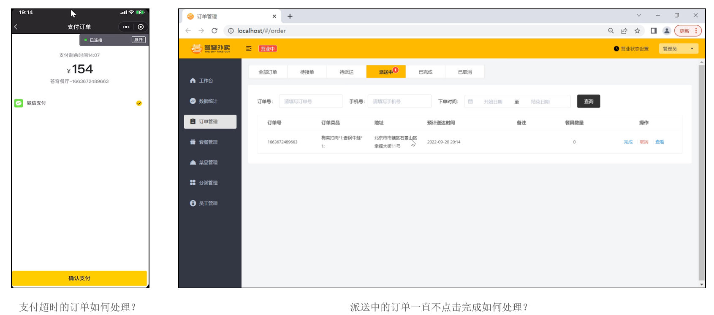 


**来单提醒**：

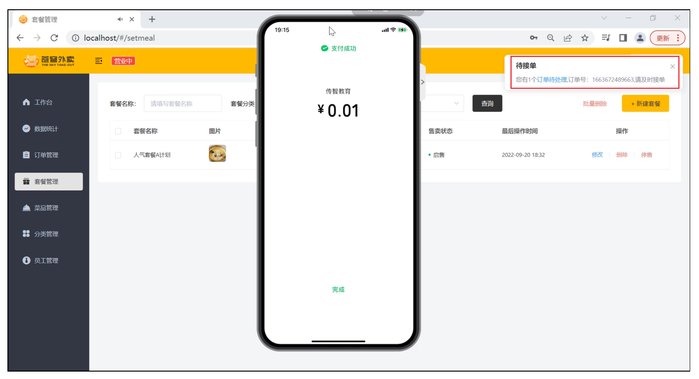 


**客户催单**：

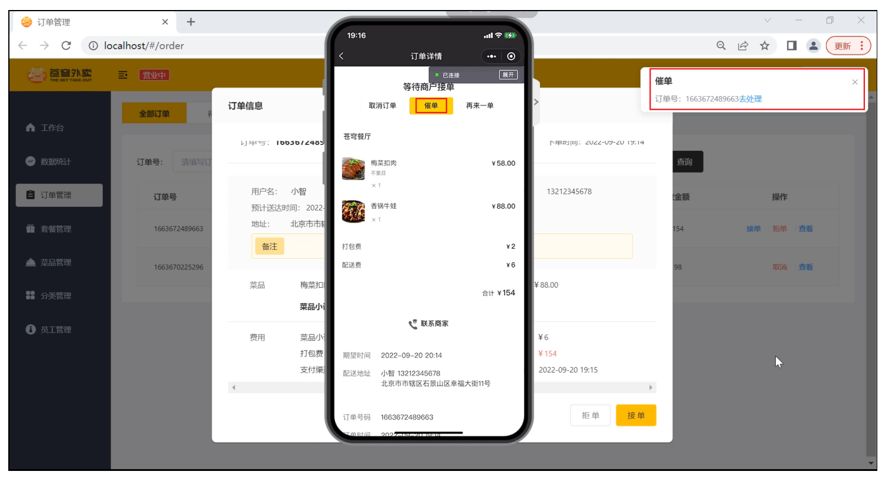 

# 一、Spring Task

## 1、介绍

**Spring Task** 是 Spring 框架提供的任务调度工具，可以按照约定的时间自动执行某个代码逻辑。

**定位**：定时任务框架

**作用**：定时自动执行某段 Java 代码


  为什么要在 Java 程序中使用 Spring Task？

**应用场景**：

1)、信用卡每月还款提醒

 


2)、银行贷款每月还款提醒

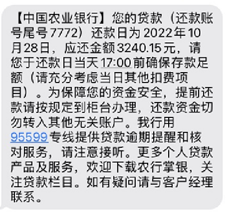 


3)、火车票售票系统处理未支付订单

 


4). 入职纪念日为用户发送通知

 


> **强调**：只要是需要定时处理的场景都可以使用 Spring Task

## 2、cron 表达式

**cron 表达式**其实就是一个字符串，通过 cron 表达式可以**定义任务触发的时间**

**构成规则**：分为 6 或 7 个域，由空格分隔开，每个域代表一个含义

每个域的含义分别为：秒、分钟、小时、日、月、周几、年(可选)

**举例**：

2022 年 10 月 12 日上午 9 点整 对应的 cron 表达式为：**0 0 9 12 10 ? 2022**

 

**说明**：一般**日**和**周**的值不同时设置，其中一个设置，另一个用 ？表示。

**比如**：描述 2 月份的最后一天，最后一天具体是几号呢？可能是 28 号，也有可能是 29 号，所以就不能写具体数字。

为了描述这些信息，提供一些特殊的字符。这些具体的细节，我们就不用自己去手写，因为这个 cron 表达式，它其实有在线生成器。

cron 表达式在线生成器：https://cron.qqe2.com/

 


可以直接在这个网站上面，只要根据自己的要求去生成 corn 表达式即可。所以一般就不用自己去编写这个表达式。

**通配符**：

\* 表示所有值； 

? 表示未说明的值，即不关心它为何值； 

\- 表示一个指定的范围； 

, 表示附加一个可能值； 

/ 符号前表示开始时间，符号后表示每次递增的值；

**cron表达式案例**：

`*/5 * * * * ?`：每隔 5 秒执行一次

`0 */1 * * * ?`：每隔 1 分钟执行一次

`0 0 5-15 * * ?`：每天 5-15 点整点触发

`0 0/3 * * * ?`：每三分钟触发一次

`0 0-5 14 * * ?`：在每天下午 2 点到下午 2:05 期间的每 1 分钟触发 

`0 0/5 14 * * ?`：在每天下午 2 点到下午 2:55 期间的每 5 分钟触发

`0 0/5 14,18 * * ?`：在每天下午 2 点到 2:55 期间和下午 6 点到 6:55 期间的每 5 分钟触发

`0 0/30 9-17 * * ?`：朝九晚五工作时间内每半小时

`0 0 10,14,16 * * ?`：每天上午 10 点，下午 2 点，4 点 

## 3、入门案例

### 3.1、Spring Task 使用步骤

1）导入 maven 坐标 spring-context（已存在）

 

2）启动类添加注解 @EnableScheduling 开启任务调度

3）自定义定时任务类

### 3.2、代码开发

**编写定时任务类**：

进入 sky-server 模块中。新建包 task，包下创建类 MyTask

注意定时任务类上面要加 @Component 注解，因为这个类也需要实例化并且交给 Spring 容器管理

然后自己定义一个方法，这个方法没有返回值，方法名任意，一般定时任务具体处理的业务逻辑写在这个方法里

方法上添加注解 @Scheduled，通过这个注解指定任务什么时候触发

```java
package com.sky.task;

import lombok.extern.slf4j.Slf4j;
import org.springframework.scheduling.annotation.Scheduled;
import org.springframework.stereotype.Component;

import java.util.Date;

/**
 * 自定义定时任务类
 */
@Component
@Slf4j
public class MyTask {
    /**
     * 定时任务 每隔5秒触发一次
     */
    @Scheduled(cron = "0/5 * * * * ?")
    public void executeTask(){
        log.info("定时任务开始执行：{}",new Date());
    }
}
```

**开启任务调度**：

启动类添加注解 @EnableScheduling

```java
package com.sky;

import lombok.extern.slf4j.Slf4j;
import org.springframework.boot.SpringApplication;
import org.springframework.boot.autoconfigure.SpringBootApplication;
import org.springframework.cache.annotation.EnableCaching;
import org.springframework.scheduling.annotation.EnableScheduling;
import org.springframework.transaction.annotation.EnableTransactionManagement;

@SpringBootApplication
@EnableTransactionManagement //开启注解方式的事务管理
@Slf4j
@EnableCaching //开启缓存注解功能
@EnableScheduling //开启任务调度
public class SkyApplication {
    public static void main(String[] args) {
        SpringApplication.run(SkyApplication.class, args);
        log.info("server started");
    }
}
```

### 3.3、功能测试

启动服务，查看日志

 

每隔 5 秒执行一次。

# 二、订单状态定时处理

## 1、需求分析

用户下单后可能存在的情况：

- 下单后未支付，订单一直处于 “**待支付**” 状态
- 用户收货后管理端未点击完成按钮，订单一直处于 “**派送中**” 状态

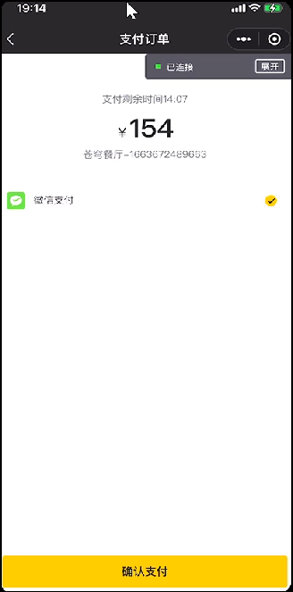                  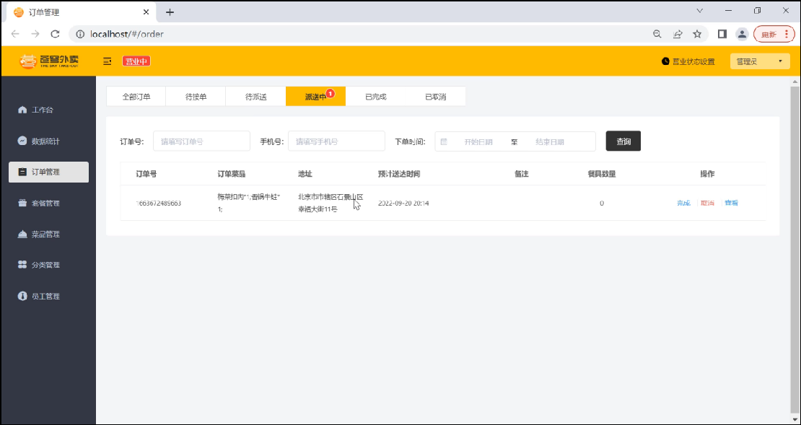

支付超时的订单如何处理？                                                       派送中的订单一直不点击完成如何处理？


对于上面两种情况需要通过**定时任务**来修改订单状态，具体逻辑为：

- 通过定时任务每分钟检查一次是否存在支付超时订单（下单后超过 15 分钟仍未支付则判定为支付超时订单），如果存在则修改订单状态为 “已取消”
- 通过定时任务每天凌晨 1 点检查一次是否存在 “派送中” 的订单，如果存在则修改订单状态为 “已完成”

## 2、代码开发

**1）自定义定时任务类 OrderTask（待完善）**：

```java
package com.sky.task;

/**
 * 自定义定时任务，实现订单状态定时处理
 */
@Component
@Slf4j
public class OrderTask {
    @Autowired
    private OrderMapper orderMapper;

    /**
     * 处理支付超时订单
     */
    @Scheduled(cron = "0 * * * * ? ")//每分钟触发一次
    public void processTimeoutOrder(){
        log.info("处理支付超时订单：{}", LocalDateTime.now());
    }

    /**
     * 处理一直处于“派送中”状态的订单
     */
    @Scheduled(cron = "0 0 1 * * ? ")//每天凌晨1点触发一次
    public void processDeliveryOrder(){
		log.info("定时处理处于派送中的订单：{}",LocalDateTime.now());
    }
}
```

**2）在 OrderMapper 接口中扩展方法**：

```java
/**
 * 根据状态和下单时间查询订单
 * @param status
 * @param orderTime
 */
@Select("select * from orders where status = #{status} and order_time < #{orderTime}")
List<Orders> getByStatusAndOrdertimeLT(Integer status, LocalDateTime orderTime);
```

**3）完善定时任务类的 processTimeoutOrder 方法**：

```java
/**
 * 处理支付超时订单
 */
@Scheduled(cron = "0 * * * * ?")
public void processTimeoutOrder(){
    log.info("处理支付超时订单：{}", LocalDateTime.now());

    LocalDateTime time = LocalDateTime.now().plusMinutes(-15);

    // select * from orders where status = 1 and order_time < (当前时间-15分钟)
    List<Orders> ordersList = orderMapper.getByStatusAndOrdertimeLT(Orders.PENDING_PAYMENT, time);
    
    if(ordersList != null && ordersList.size() > 0){
        for (Orders orders : ordersList) {
            orders.setStatus(Orders.CANCELLED);
            orders.setCancelReason("订单超时，自动取消");
            orders.setCancelTime(LocalDateTime.now());
            orderMapper.update(orders);
        }
    }
}
```

**4）完善定时任务类的 processDeliveryOrder 方法**：

```java
/**
 * 处理“派送中”状态的订单
 */
@Scheduled(cron = "0 0 1 * * ?")
public void processDeliveryOrder(){
	log.info("定时处理处于派送中的订单：{}",LocalDateTime.now());
    
    // select * from orders where status = 4 and order_time < 当前时间-1小时
    LocalDateTime time = LocalDateTime.now().plusMinutes(-60);
    
    List<Orders> ordersList = orderMapper.getByStatusAndOrdertimeLT(Orders.DELIVERY_IN_PROGRESS, time);

    if(ordersList != null && ordersList.size() > 0){
		for (Orders orders : ordersList) {
            orders.setStatus(Orders.COMPLETED);
            orderMapper.update(orders);
        }
    }
}
```

## 3、功能测试

可以通过如下方式进行测试：

- 查看控制台sql
- 查看数据库中数据变化

**支付超时的订单测试**：

**1)、查看订单表**

有一条订单，状态为 1。订单状态 1 待付款 2 待接单 3 已接单 4 派送中 5 已完成 6 已取消

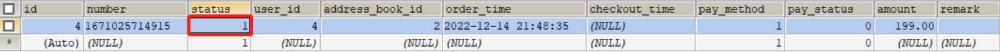 


**2)、开启定时任务**

启动服务，观察控制台日志。处理支付超时订单任务每隔 1 分钟执行一次。

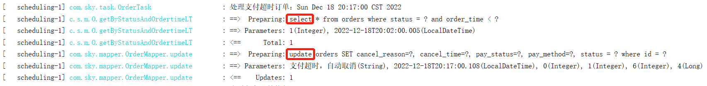 


**3)、再次查看订单表**

状态已更改为 6，已取消。

 

证明定时任务已生效。

**处理 “派送中” 状态的订单任务**测试不再演示，测试步骤和上述一致。可适当修改 cron 表达式，改变任务执行频率，方便测试。

# 三、WebSocket

## 1、介绍

WebSocket 是基于 TCP 的一种新的**网络协议**。它实现了浏览器与服务器全双工通信——浏览器和服务器只需要完成一次握手，两者之间就可以创建**持久性**的连接， 并进行**双向**数据传输。

**HTTP 协议和 WebSocket 协议对比**：

- HTTP 是**短连接**
- WebSocket 是**长连接**
- HTTP 通信是**单向**的，基于请求响应模式
- WebSocket 支持**双向**通信
- HTTP 和 WebSocket 底层都是 TCP 连接

            

**思考**：既然 WebSocket 支持双向通信，功能看似比 HTTP 强大，那么我们是不是可以基于 WebSocket 开发所有的业务功能？

**WebSocket 缺点**：

* 服务器长期维护长连接需要一定的成本
* 各个浏览器支持程度不一
* WebSocket 是长连接，受网络限制比较大，需要处理好重连

> **结论**：WebSocket 并不能完全取代 HTTP，它只适合在特定的场景下使用

**WebSocket 应用场景**：

1）视频弹幕

v


2）网页聊天

 


3）体育实况更新

 


4）股票基金报价实时更新

 

## 2、入门案例

### 2.1、案例分析

**需求**：实现浏览器与服务器全双工通信。浏览器既可以向服务器发送消息，服务器也可主动向浏览器推送消息。

**效果展示**：

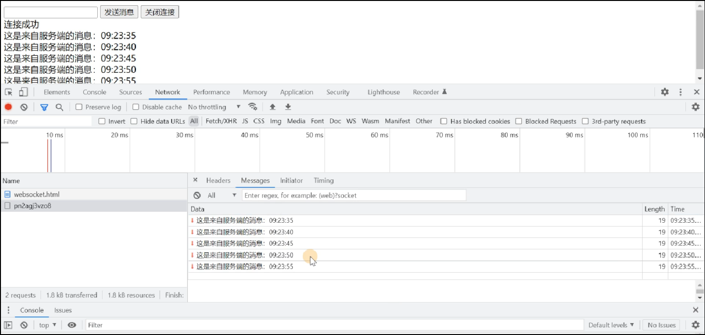 

**实现步骤**：

1. 直接使用 websocket.html 页面作为 WebSocket 客户端
2. 导入 WebSocket 的 maven 坐标
3. 导入 WebSocket 服务端组件 WebSocketServer，用于和客户端通信
4. 导入配置类 WebSocketConfiguration，注册 WebSocket 的服务端组件
5. 导入定时任务类 WebSocketTask，定时向客户端推送数据

### 2.2、代码开发

1）定义 websocket.html 页面

```html
<!DOCTYPE HTML>
<html>
<head>
    <meta charset="UTF-8">
    <title>WebSocket Demo</title>
</head>
<body>
    <input id="text" type="text" />
    <button onclick="send()">发送消息</button>
    <button onclick="closeWebSocket()">关闭连接</button>
    <div id="message">
    </div>
</body>
<script type="text/javascript">
    var websocket = null;
    var clientId = Math.random().toString(36).substr(2);

    //判断当前浏览器是否支持WebSocket
    if('WebSocket' in window){
        //连接WebSocket节点
        websocket = new WebSocket("ws://localhost:8080/ws/"+clientId);
    }
    else{
        alert('Not support websocket')
    }

    //连接发生错误的回调方法
    websocket.onerror = function(){
        setMessageInnerHTML("error");
    };

    //连接成功建立的回调方法
    websocket.onopen = function(){
        setMessageInnerHTML("连接成功");
    }

    //接收到消息的回调方法
    websocket.onmessage = function(event){
        setMessageInnerHTML(event.data);
    }

    //连接关闭的回调方法
    websocket.onclose = function(){
        setMessageInnerHTML("close");
    }

    //监听窗口关闭事件，当窗口关闭时，主动去关闭websocket连接，防止连接还没断开就关闭窗口，server端会抛异常。
    window.onbeforeunload = function(){
        websocket.close();
    } 

    //将消息显示在网页上
    function setMessageInnerHTML(innerHTML){
        document.getElementById('message').innerHTML += innerHTML + '<br/>';
    }

    //发送消息
    function send(){
        var message = document.getElementById('text').value;
        websocket.send(message);
    }
	
	//关闭连接
    function closeWebSocket() {
        websocket.close();
    }
</script>
</html>
```


2）导入 maven 坐标

在 sky-server 模块 pom.xml 中定义

```xml
<dependency>
	<groupId>org.springframework.boot</groupId>
	<artifactId>spring-boot-starter-websocket</artifactId>
</dependency>
```


3）定义 WebSocket 服务端组件

进入 sky-server 模块，新建包 websocket，包下新建 WebSocketServer.java

```java
package com.sky.websocket;

import org.springframework.stereotype.Component;
import javax.websocket.OnClose;
import javax.websocket.OnMessage;
import javax.websocket.OnOpen;
import javax.websocket.Session;
import javax.websocket.server.PathParam;
import javax.websocket.server.ServerEndpoint;
import java.util.Collection;
import java.util.HashMap;
import java.util.Map;

/**
 * WebSocket服务
 */
@Component
@ServerEndpoint("/ws/{sid}")
public class WebSocketServer {
    //存放会话对象
    private static Map<String, Session> sessionMap = new HashMap();

    /**
     * 连接建立成功调用的方法
     */
    @OnOpen
    public void onOpen(Session session, @PathParam("sid") String sid) {
        System.out.println("客户端：" + sid + "建立连接");
        sessionMap.put(sid, session);
    }

    /**
     * 收到客户端消息后调用的方法
     * @param message 客户端发送过来的消息
     */
    @OnMessage
    public void onMessage(String message, @PathParam("sid") String sid) {
        System.out.println("收到来自客户端：" + sid + "的信息:" + message);
    }

    /**
     * 连接关闭调用的方法
     * @param sid
     */
    @OnClose
    public void onClose(@PathParam("sid") String sid) {
        System.out.println("连接断开:" + sid);
        sessionMap.remove(sid);
    }

    /**
     * 群发
     * @param message
     */
    public void sendToAllClient(String message) {
        Collection<Session> sessions = sessionMap.values();
        for (Session session : sessions) {
            try {
                //服务器向客户端发送消息
                session.getBasicRemote().sendText(message);
            } catch (Exception e) {
                e.printStackTrace();
            }
        }
    }
}
```


4）定义配置类，注册 WebSocket 的服务端组件

在 sky-server 模块的 config 包下新建配置类 WebSocketConfiguration：

```java
package com.sky.config;

import org.springframework.context.annotation.Bean;
import org.springframework.context.annotation.Configuration;
import org.springframework.web.socket.server.standard.ServerEndpointExporter;

/**
 * WebSocket配置类，用于注册WebSocket的Bean
 */
@Configuration
public class WebSocketConfiguration {
    @Bean
    public ServerEndpointExporter serverEndpointExporter() {
        return new ServerEndpointExporter();
    }
}
```


5）定义定时任务类，定时向客户端推送数据

在 sky-server 模块的 task 包下定时任务类 WebSocketTask：

```java
package com.sky.task;

import com.sky.websocket.WebSocketServer;
import org.springframework.beans.factory.annotation.Autowired;
import org.springframework.scheduling.annotation.Scheduled;
import org.springframework.stereotype.Component;
import java.time.LocalDateTime;
import java.time.format.DateTimeFormatter;

@Component
public class WebSocketTask {
    @Autowired
    private WebSocketServer webSocketServer;

    /**
     * 通过WebSocket每隔5秒向客户端发送消息
     */
    @Scheduled(cron = "0/5 * * * * ?")
    public void sendMessageToClient() {
        webSocketServer.sendToAllClient("这是来自服务端的消息：" + DateTimeFormatter.ofPattern("HH:mm:ss").format(LocalDateTime.now()));
    }
}
```

### 2.3、功能测试

启动服务，打开 websocket.html 页面

**浏览器向服务器发送数据**：

 


**服务器向浏览器间隔 5 秒推送数据**：

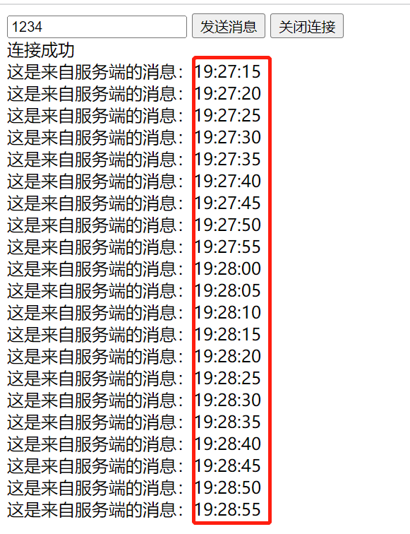 

# 四、来单提醒

## 1、需求分析和设计

用户下单并且支付成功后，需要第一时间通知外卖商家。通知的形式有如下两种：

- 语音播报  
- 弹出提示框

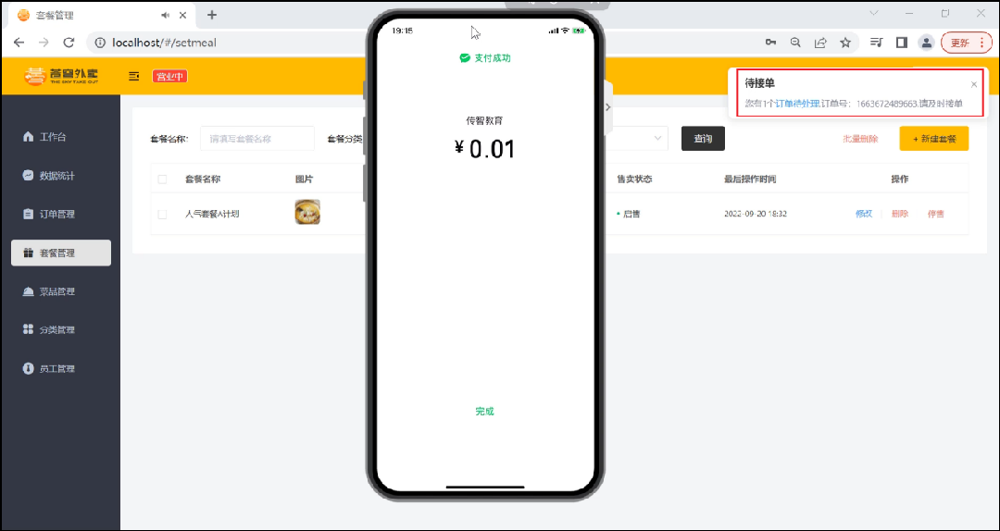 


**设计思路**：

- 通过 WebSocket 实现管理端页面和服务端保持长连接状态
- 当客户支付后，调用 WebSocket 的相关 API 实现服务端向客户端推送消息
- 客户端浏览器解析服务端推送的消息，判断是来单提醒还是客户催单，进行相应的消息提示和语音播报
- 约定服务端发送给客户端浏览器的数据格式为 JSON，字段包括：type，orderId，content
  - type 为消息类型，1 为来单提醒，2 为客户催单
  - orderId 为订单 id
  - content 为消息内容

## 2、代码开发

**在 OrderServiceImpl 中注入 WebSocketServer 对象，修改 paySuccess 方法，加入如下代码**：

```java
@Autowired
private WebSocketServer webSocketServer;

/**
 * 支付成功，修改订单状态
 * @param outTradeNo
 */
public void paySuccess(String outTradeNo) {
    // 当前登录用户id
    Long userId = BaseContext.getCurrentId();

    // 根据订单号查询当前用户的订单
    Orders ordersDB = orderMapper.getByNumberAndUserId(outTradeNo, userId);

    // 根据订单id更新订单的状态、支付方式、支付状态、结账时间
    Orders orders = Orders.builder()
        .id(ordersDB.getId())
        .status(Orders.TO_BE_CONFIRMED)
        .payStatus(Orders.PAID)
        .checkoutTime(LocalDateTime.now())
        .build();

    orderMapper.update(orders);
    
    //////////////////////////////////////////////
    Map map = new HashMap();
    map.put("type", 1);//消息类型，1表示来单提醒
    map.put("orderId", orders.getId());
    map.put("content", "订单号：" + outTradeNo);

    //通过WebSocket实现来单提醒，向客户端浏览器推送消息
	String json = JSON.toJSONString(map);
    webSocketServer.sendToAllClient(json);
    ///////////////////////////////////////////////////
}
```

## 3、功能测试

可以通过如下方式进行测试：

- 查看浏览器调试工具数据交互过程
- 前后端联调

**1)、登录管理端后台**

登录成功后，浏览器与服务器建立长连接

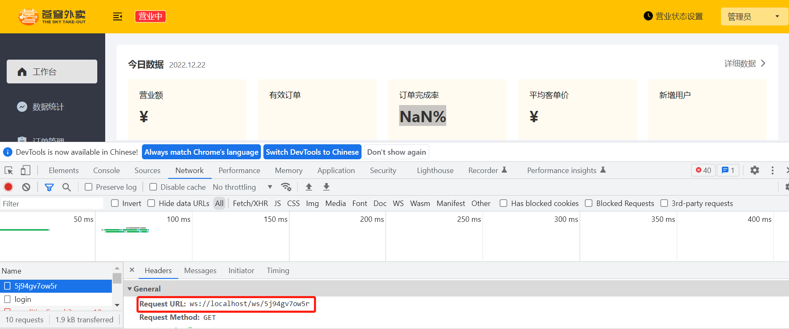 


查看控制台日志：

 


**2)、小程序端下单支付**

修改回调地址，利用内网穿透获取域名

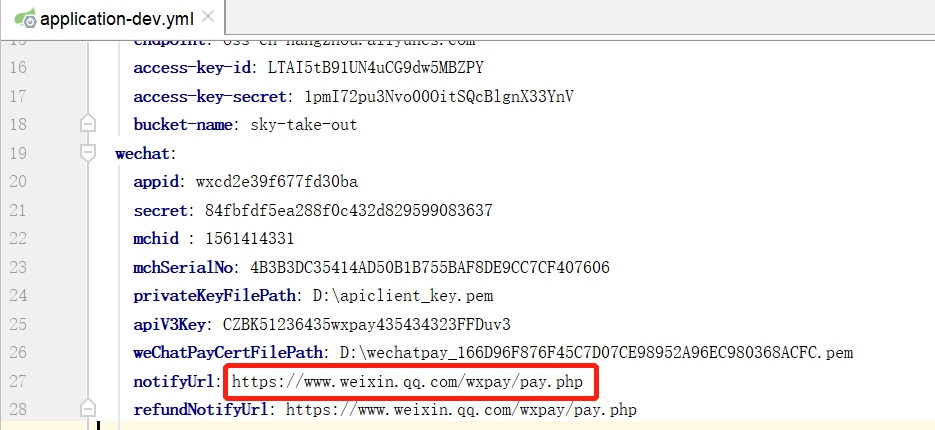 


下单支付

   


**3)、查看来单提醒**

支付成功后，后台收到来单提醒，并有语音播报

 


## 4、代码提交

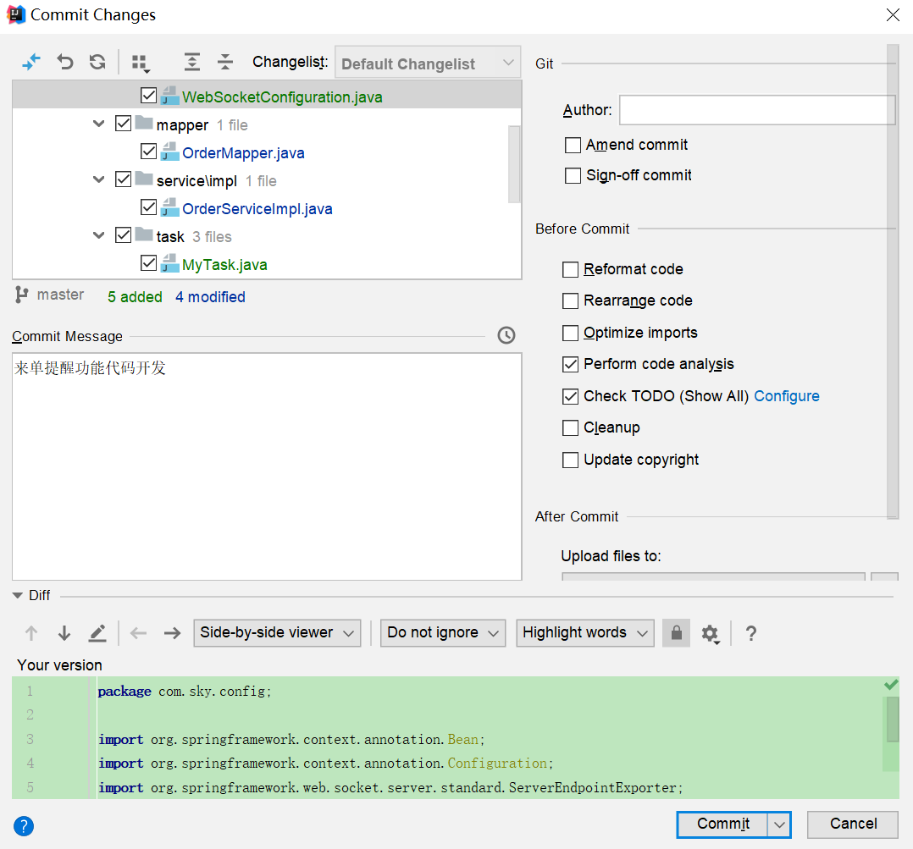 

后续步骤和其它功能代码提交一致，不再赘述。

# 五、客户催单

## 1、需求分析和设计

用户在小程序中点击催单按钮后，需要第一时间通知外卖商家。通知的形式有如下两种：

- 语音播报 
- 弹出提示框

 


**设计思路**：

- 通过 WebSocket 实现管理端页面和服务端保持长连接状态
- 当用户点击催单按钮后，调用 WebSocket 的相关 API 实现服务端向客户端推送消息
- 客户端浏览器解析服务端推送的消息，判断是来单提醒还是客户催单，进行相应的消息提示和语音播报
- 约定服务端发送给客户端浏览器的数据格式为 JSON，字段包括：type，orderId，content
  - type 为消息类型，1 为来单提醒，2 为客户催单
  - orderId 为订单 id
  - content 为消息内容


当用户点击催单按钮时，向服务端发送请求。

**接口设计**：

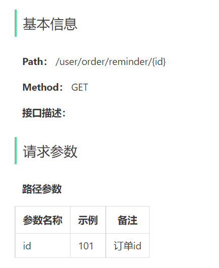 

## 2、代码开发

### 2.1、Controller层

**根据用户催单的接口定义，在 user/OrderController 中创建催单方法**：

```java
/**
 * 用户催单
 * @param id
 * @return
 */
@GetMapping("/reminder/{id}")
@ApiOperation("用户催单")
public Result reminder(@PathVariable("id") Long id) {
    orderService.reminder(id);
    return Result.success();
}
```

### 2.2、Service层接口

**在 OrderService 接口中声明 reminder 方法**：

```java
/**
 * 用户催单
 * @param id
 */
void reminder(Long id);
```

### 2.3、Service层实现类

**在 OrderServiceImpl 中实现 reminder 方法**：

```java
/**
 * 用户催单
 * @param id
 */
public void reminder(Long id) {
    // 查询订单是否存在
    Orders orders = orderMapper.getById(id);
    if (orders == null) {
        throw new OrderBusinessException(MessageConstant.ORDER_NOT_FOUND);
    }

    //通过websocket向客户端浏览器推送消息
    Map map = new HashMap();
    map.put("type", 2);//1表示来单提醒，2代表用户催单
    map.put("orderId", id);
    map.put("content", "订单号：" + orders.getNumber());
    webSocketServer.sendToAllClient(JSON.toJSONString(map));
}
```

### 2.4、Mapper层

**在 OrderMapper 中添加 getById**：

```java
/**
 * 根据id查询订单
 * @param id
 */
@Select("select * from orders where id=#{id}")
Orders getById(Long id);
```

## 3、功能测试

可以通过如下方式进行测试：

- 查看浏览器调试工具数据交互过程
- 前后端联调

**1）登录管理端后台**

登录成功后，浏览器与服务器建立长连接


 

查看控制台日志

 


**2）用户进行催单**

用户可在订单列表或者订单详情，进行催单

 


**3）查看催单提醒**

既有催单弹窗，同时语音播报

 

## 4、代码提交

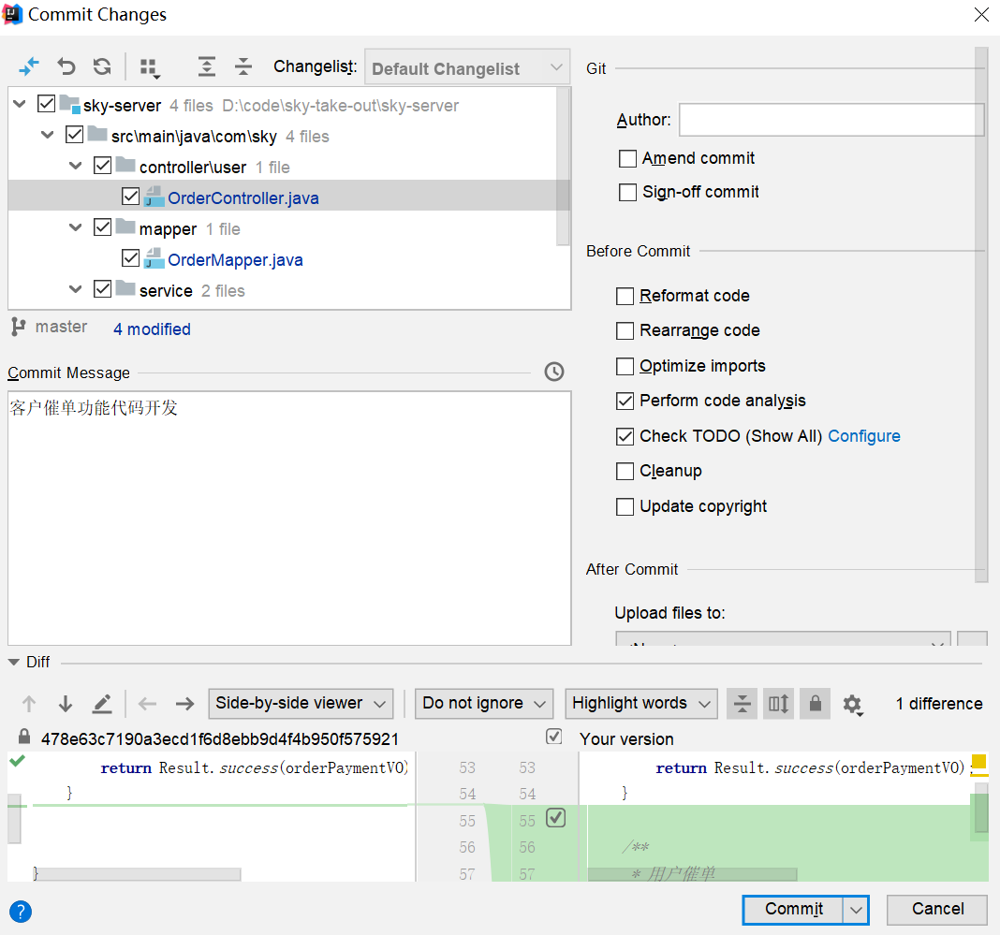 

后续步骤和其它功能代码提交一致，不再赘述。