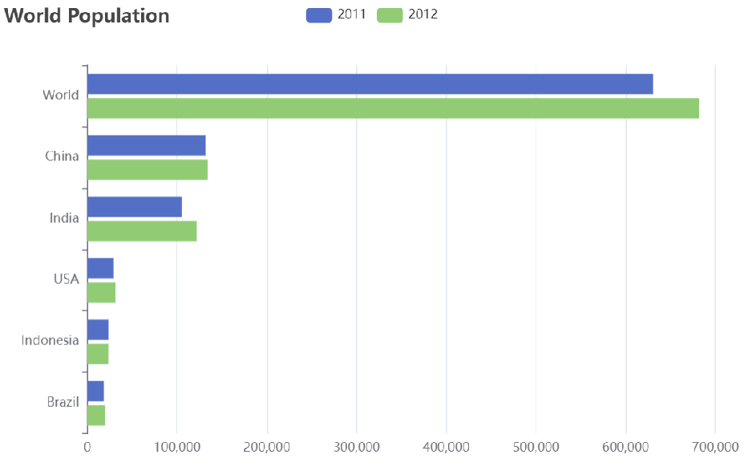

# 今日内容

- Apache ECharts
- 营业额统计
- 用户统计
- 订单统计
- 销量排名 Top10


功能实现：**数据统计**

**数据统计效果图**：

 

# 一、Apache ECharts

## 1、介绍

Apache ECharts 是一款基于 Javascript 的数据可视化图表库，提供直观，生动，可交互，可个性化定制的数据可视化图表。

官网地址：[https://echarts.apache.org/zh/index.html](https://echarts.apache.org/zh/index.html)

 

**常见效果展示**：

1）柱形图

 


2）饼形图

 


3）折线图

 


> **总结**：不管是哪种形式的图形，最本质的东西实际上是数据，它其实是对数据的一种可视化展示。

## 2、入门案例

Apache Echarts 官方提供的快速入门：[https://echarts.apache.org/handbook/zh/get-started/](https://echarts.apache.org/handbook/zh/get-started/)

**效果展示**：

 

**实现步骤**：

1. 参考官方文档，下载 echart.js 文件
2. 新建 echartsDemo.html 文件，引入 echarts.js 文件
3. 为 ECharts 准备一个设置宽高的 DOM
4. 初始化 echarts 实例
5. 指定图表的配置项和数据
6. 使用指定的配置项和数据显示图表

**代码开发**：

```html
<!DOCTYPE html>
<html>
  <head>
    <meta charset="utf-8" />
    <title>ECharts</title>
    <!-- 引入刚刚下载的 ECharts 文件 -->
    <script src="echarts.js"></script>
  </head>
  <body>
    <!-- 为 ECharts 准备一个定义了宽高的 DOM -->
    <div id="main" style="width: 600px;height:400px;"></div>
    <script type="text/javascript">
      // 基于准备好的dom，初始化echarts实例
      var myChart = echarts.init(document.getElementById('main'));

      // 指定图表的配置项和数据
      var option = {
        title: {
          text: 'ECharts 入门示例'
        },
        tooltip: {},
        legend: {
          data: ['销量']
        },
        xAxis: {
          data: ['衬衫', '羊毛衫', '雪纺衫', '裤子', '高跟鞋', '袜子']
        },
        yAxis: {},
        series: [
          {
            name: '销量',
            type: 'bar',
            data: [5, 20, 36, 10, 10, 20]
          }
        ]
      };

      // 使用刚指定的配置项和数据显示图表。
      myChart.setOption(option);
    </script>
  </body>
</html>
```

**测试**：

使用浏览器方式打开 echartsDemo 文件即可。

> **总结**：使用 Echarts，重点在于研究当前图表所需的数据格式。通常是需要后端提供符合格式要求的动态数据，然后响应给前端来展示图表。

# 二、营业额统计

## 1、需求分析和设计

### 1.1、产品原型

营业额统计是基于折现图来展现，并且按照天来展示的。实际上，就是某一个时间范围之内的每一天的营业额。同时，不管光标放在哪个点上，那么它就会把具体的数值展示出来。并且还需要注意日期并不是固定写死的，是由上边时间选择器来决定。比如选择是近 7 天、或者是近 30 日，或者是本周，就会把相应这个时间段之内的每一天日期通过横坐标展示。

**原型图**：

 

**业务规则**：

- 营业额指订单状态为已完成的订单金额合计
- 基于可视化报表的折线图展示营业额数据，X 轴为日期，Y 轴为营业额
- 根据时间选择区间，展示每天的营业额数据

### 1.2、接口设计

通过上述原型图，设计出对应的接口。

  

**注意**：具体返回数据一般由前端来决定，前端展示图表，具体折现图对应数据是什么格式，是有固定的要求的。
所以说，后端需要去适应前端，它需要什么格式的数据，我们就给它返回什么格式的数据。

## 2、代码开发

### 2.1、VO 设计

**根据接口定义设计对应的 VO**：

 

在 sky-pojo 模块，TurnoverReportVO.java 已定义

```java
package com.sky.vo;

import lombok.AllArgsConstructor;
import lombok.Builder;
import lombok.Data;
import lombok.NoArgsConstructor;

import java.io.Serializable;

@Data
@Builder
@NoArgsConstructor
@AllArgsConstructor
public class TurnoverReportVO implements Serializable {
    //日期，以逗号分隔，例如：2022-10-01,2022-10-02,2022-10-03
    private String dateList;

    //营业额，以逗号分隔，例如：406.0,1520.0,75.0
    private String turnoverList;
}
```

### 2.2、Controller 层

**根据接口定义创建 ReportController**：

```java
package com.sky.controller.admin;

import com.sky.result.Result;
import com.sky.service.ReportService;
import com.sky.vo.TurnoverReportVO;
import io.swagger.annotations.Api;
import io.swagger.annotations.ApiOperation;
import lombok.extern.slf4j.Slf4j;
import org.springframework.beans.factory.annotation.Autowired;
import org.springframework.format.annotation.DateTimeFormat;
import org.springframework.web.bind.annotation.GetMapping;
import org.springframework.web.bind.annotation.RequestMapping;
import org.springframework.web.bind.annotation.RestController;
import java.time.LocalDate;

/**
 * 数据统计相关接口
 */
@RestController
@RequestMapping("/admin/report")
@Slf4j
@Api(tags = "数据统计相关接口")
public class ReportController {
    @Autowired
    private ReportService reportService;

    /**
     * 营业额数据统计
     * @param begin
     * @param end
     * @return
     */
    @GetMapping("/turnoverStatistics")
    @ApiOperation("营业额数据统计")
    public Result<TurnoverReportVO> turnoverStatistics(
            @DateTimeFormat(pattern = "yyyy-MM-dd") LocalDate begin,
            @DateTimeFormat(pattern = "yyyy-MM-dd") LocalDate end) {
        log.info("营业额数据统计：{}——{}",begin,end);
        return Result.success(reportService.getTurnover(begin, end));
    }
}
```

### 2.3、Service 层接口

**创建 ReportService 接口，声明 getTurnover 方法**：

```java
package com.sky.service;

import com.sky.vo.TurnoverReportVO;
import java.time.LocalDate;

public interface ReportService {
    /**
     * 统计指定时间区间内的营业额数据
     * @param beginTime
     * @param endTime
     * @return
     */
    TurnoverReportVO getTurnover(LocalDate beginTime, LocalDate endTime);
}
```

### 2.4、Service 层实现类

**创建 ReportServiceImpl 实现类，实现 getTurnover 方法**：

```java
package com.sky.service.impl;

import com.sky.entity.Orders;
import com.sky.mapper.OrderMapper;
import com.sky.service.ReportService;
import com.sky.vo.TurnoverReportVO;
import lombok.extern.slf4j.Slf4j;
import org.apache.commons.lang.StringUtils;
import org.springframework.beans.factory.annotation.Autowired;
import org.springframework.stereotype.Service;
import java.time.LocalDate;
import java.time.LocalDateTime;
import java.time.LocalTime;
import java.util.ArrayList;
import java.util.HashMap;
import java.util.List;
import java.util.Map;

@Service
@Slf4j
public class ReportServiceImpl implements ReportService {
    @Autowired
    private OrderMapper orderMapper;

    /**
     * 统计指定时间区间内的营业额数据
     * @param begin
     * @param end
     * @return
     */
    public TurnoverReportVO getTurnover(LocalDate begin, LocalDate end) {
        //当前集合用于存放begin到end范围内的每天的日期
        List<LocalDate> dateList = new ArrayList<>();
        dateList.add(begin);

        while (!begin.equals(end)){
            begin = begin.plusDays(1);//日期计算，获得指定日期后1天的日期
            dateList.add(begin);
        }
        
        //存放每天的营业额
        List<Double> turnoverList = new ArrayList<>();
        for (LocalDate date : dateList) {
            //查询date日期对应的营业额数据，营业额是指状态为“已完成”的订单金额合计
            LocalDateTime beginTime = LocalDateTime.of(date, LocalTime.MIN);
            LocalDateTime endTime = LocalDateTime.of(date, LocalTime.MAX);
            
            //select sum(amount) from orders where order_time > beginTime and order_time < endTime and status = 5
            Map map = new HashMap();
        	map.put("begin",beginTime);
        	map.put("end", endTime);
           	map.put("status", Orders.COMPLETED);
            
            Double turnover = orderMapper.sumByMap(map); 
            turnover = turnover == null ? 0.0 : turnover;
            turnoverList.add(turnover);
        }

        //封装返回结果
        return TurnoverReportVO
                .builder()
                .dateList(StringUtils.join(dateList,","))
                .turnoverList(StringUtils.join(turnoverList,","))
                .build();
    }
}
```

### 2.5、Mapper 层

**在 OrderMapper 接口声明 sumByMap 方法**：

```java
/**
 * 根据动态条件统计营业额
 * @param map
 */
Double sumByMap(Map map);
```

**在 OrderMapper.xml 文件中编写动态 SQL**：

```xml
<select id="sumByMap" resultType="java.lang.Double">
    select sum(amount) from orders
    <where>
        <if test="begin != null">
            and order_time &gt;= #{begin}
        </if>
        <if test="end != null">
            and order_time &lt;= #{end}
        </if>
        <if test="status != null">
            and status = #{status}
        </if>
    </where>
</select>
```

## 3、功能测试

可以通过如下方式进行测试：

- 接口文档测试
- 前后端联调测试

启动服务器，启动 nginx，直接采用前后端联调测试。

进入数据统计模块

**1）查看近 7 日营业额统计**

 

进入开发者模式，查看返回数据

 

**2）查看近 30 日营业额统计**

 

进入开发者模式，查看返回数据

 

也可通过断点方式启动，查看每步执行情况。

## 4、代码提交

 

后续步骤和其它功能代码提交一致，不再赘述。

# 三、用户统计

## 1、需求分析和设计

### 1.1、产品原型

所谓用户统计，实际上统计的是用户的数量。通过折线图来展示，上面这根蓝色线代表的是用户总量，下边这根绿色线代表的是新增用户数量，是具体到每一天。所以说用户统计主要统计**两个数据**，一个是**总的用户数量**，另外一个是**新增用户数量**。

**原型图**：

 

**业务规则**：

- 基于可视化报表的折线图展示用户数据，X 轴为日期，Y 轴为用户数
- 根据时间选择区间，展示每天的用户总量和新增用户量数据

### 1.2、接口设计

根据上述原型图设计接口。

  

## 2、代码开发

### 2.1、VO 设计

**根据用户统计接口的返回结果设计VO**：

 

在 sky-pojo 模块，UserReportVO.java 已定义：

```java
package com.sky.vo;

import lombok.AllArgsConstructor;
import lombok.Builder;
import lombok.Data;
import lombok.NoArgsConstructor;
import java.io.Serializable;

@Data
@Builder
@NoArgsConstructor
@AllArgsConstructor
public class UserReportVO implements Serializable {
    //日期，以逗号分隔，例如：2022-10-01,2022-10-02,2022-10-03
    private String dateList;

    //用户总量，以逗号分隔，例如：200,210,220
    private String totalUserList;

    //新增用户，以逗号分隔，例如：20,21,10
    private String newUserList;
}
```

###  2.2、Controller 层

**根据接口定义，在 ReportController 中创建 userStatistics 方法**：

```java
/**
 * 用户数据统计
 * @param begin
 * @param end
 * @return
 */
@GetMapping("/userStatistics")
@ApiOperation("用户数据统计")
public Result<UserReportVO> userStatistics(
    	@DateTimeFormat(pattern = "yyyy-MM-dd") LocalDate begin,
    	@DateTimeFormat(pattern = "yyyy-MM-dd") LocalDate end){
	log.info("用户数据统计：{}——{}",begin,end);
    return Result.success(reportService.getUserStatistics(begin,end));            
}
```

### 2.3、Service 层接口

**在 ReportService 接口中声明 getUserStatistics 方法**：

```java
/**
 * 根据时间区间统计用户数量
 * @param begin
 * @param end
 * @return
 */
UserReportVO getUserStatistics(LocalDate begin, LocalDate end);
```

### 2.4、Service 层实现类

**在 ReportServiceImpl 实现类中实现 getUserStatistics 方法**：

```java
/**
 * 根据时间区间统计用户数量
 * @param begin
 * @param end
 * @return
 */
@Override
public UserReportVO getUserStatistics(LocalDate begin, LocalDate end) {
    //存放从begin到end之间的每天对应的日期
    List<LocalDate> dateList = new ArrayList<>();
    dateList.add(begin);

    while (!begin.equals(end)){
        begin = begin.plusDays(1);
        dateList.add(begin);
    }
    
    //存放每天的新增用户数量
    List<Integer> newUserList = new ArrayList<>();
    //存放每天的总用户数量
    List<Integer> totalUserList = new ArrayList<>();

    for (LocalDate date : dateList) {
        LocalDateTime beginTime = LocalDateTime.of(date, LocalTime.MIN);
        LocalDateTime endTime = LocalDateTime.of(date, LocalTime.MAX);
        
        Map map = new HashMap<>();
        map.put("end",endTime);

        //总用户数量
        //select count(id) from user where create_time < ?
        Integer totalUser = userMapper.countByMap(map);

        map.put("begin", beginTime);
        //新增用户数量
        //select count(id) from user where create_time < ? and create_time > ?
        Integer newUser = userMapper.countByMap(map);

        totalUserList.add(totalUser);
        newUserList.add(newUser);
    }

    return UserReportVO.builder()
        .dateList(StringUtils.join(dateList,","))
        .newUserList(StringUtils.join(newUserList,","))
        .totalUserList(StringUtils.join(totalUserList,","))
        .build();
}
```

### 2.5、Mapper 层

**在 UserMapper 接口中声明 countByMap 方法**：

```java
/**
 * 根据动态条件统计用户数量
 * @param map
 * @return
 */
Integer countByMap(Map map);
```

**在 UserMapper.xml 文件中编写动态 SQL**：

```java
<select id="countByMap" resultType="java.lang.Integer">
    select count(id) from user
    <where>
        <if test="begin != null">
            and create_time &gt;= #{begin}
        </if>
        <if test="end != null">
            and create_time &lt;= #{end}
        </if>
    </where>
</select>
```

## 3、功能测试

可以通过如下方式进行测试：

- 接口文档测试
- 前后端联调测试

进入数据统计模块

**1）查看近 7 日用户统计**

 

进入开发者模式，查看返回数据

 

**2）查看近 30 日用户统计**

 

进入开发者模式，查看返回数据

 

也可通过断点方式启动，查看每步执行情况。

## 4、代码提交

 

后续步骤和其它功能代码提交一致，不再赘述。

# 四、订单统计

## 1、需求分析和设计

### 1.1、产品原型

订单统计通过一个折现图来展现，折线图上有两根线，这根蓝色的线代表的是订单总数，而下边这根绿色的线代表的是有效订单数，指的就是状态是已完成的订单就属于有效订单，分别反映的是每一天的数据。上面还有 3 个数字，分别是订单总数、有效订单、订单完成率，它指的是整个时间区间之内总的数据。

**原型图**：

 

**业务规则**：

- 有效订单指状态为 “已完成” 的订单
- 基于可视化报表的折线图展示订单数据，X 轴为日期，Y 轴为订单数量
- 根据时间选择区间，展示每天的订单总数和有效订单数
- 展示所选时间区间内的有效订单数、总订单数、订单完成率，订单完成率 = 有效订单数 / 总订单数 * 100%

### 1.2、接口设计

根据上述原型图设计接口：

  

## 2、代码开发

### 2.1、VO 设计

**根据订单统计接口的返回结果设计 VO**：

 

在 sky-pojo 模块，OrderReportVO.java 已定义

```java
package com.sky.vo;

import lombok.AllArgsConstructor;
import lombok.Builder;
import lombok.Data;
import lombok.NoArgsConstructor;
import java.io.Serializable;

@Data
@Builder
@NoArgsConstructor
@AllArgsConstructor
public class OrderReportVO implements Serializable {
    //日期，以逗号分隔，例如：2022-10-01,2022-10-02,2022-10-03
    private String dateList;

    //每日订单数，以逗号分隔，例如：260,210,215
    private String orderCountList;

    //每日有效订单数，以逗号分隔，例如：20,21,10
    private String validOrderCountList;

    //订单总数
    private Integer totalOrderCount;

    //有效订单数
    private Integer validOrderCount;

    //订单完成率
    private Double orderCompletionRate;
}
```

### 2.2、Controller 层

**在 ReportController 中根据订单统计接口创建 orderStatistics方法**：

```java
/**
 * 订单数据统计
 * @param begin
 * @param end
 * @return
 */
@GetMapping("/ordersStatistics")
@ApiOperation("订单数据统计")
public Result<OrderReportVO> orderStatistics(
        @DateTimeFormat(pattern = "yyyy-MM-dd") LocalDate begin,
        @DateTimeFormat(pattern = "yyyy-MM-dd") LocalDate end){
	log.info("订单数据统计：{}——{}",begin,end);
    return Result.success(reportService.getOrderStatistics(begin,end));
}
```

### 2.3、Service 层接口

**在 ReportService 接口中声明 getOrderStatistics 方法**：

```java
/**
* 统计指定时间区间内的订单数据
* @param begin 
* @param end
* @return 
*/
OrderReportVO getOrderStatistics(LocalDate begin, LocalDate end);
```

### 2.4、Service 层实现类

**在 ReportServiceImpl 实现类中实现 getOrderStatistics 方法**：

```java
/**
* 统计指定时间区间内的订单数据
* @param begin 
* @param end
* @return 
*/
public OrderReportVO getOrderStatistics(LocalDate begin, LocalDate end){
	List<LocalDate> dateList = new ArrayList<>();
    dateList.add(begin);

    while (!begin.equals(end)){
          begin = begin.plusDays(1);
          dateList.add(begin);
    }
    
	//存放每天的订单总数
    List<Integer> orderCountList = new ArrayList<>();
    //存放每天的有效订单数
    List<Integer> validOrderCountList = new ArrayList<>();
    
    //遍历dateList集合，查询每天的有效订单数和订单总数
    for (LocalDate date : dateList) {
         LocalDateTime beginTime = LocalDateTime.of(date, LocalTime.MIN);
         LocalDateTime endTime = LocalDateTime.of(date, LocalTime.MAX);
        
         //查询每天的总订单数
         //select count(id) from orders where order_time > ? and order_time < ?
         Integer orderCount = getOrderCount(beginTime, endTime, null);

         //查询每天的有效订单数
         //select count(id) from orders where order_time > ? and order_time < ? and status = ?
         Integer validOrderCount = getOrderCount(beginTime, endTime, Orders.COMPLETED);

         orderCountList.add(orderCount);
         validOrderCountList.add(validOrderCount);
    }

    //计算时间区间内的订单总数量
    Integer totalOrderCount = orderCountList.stream().reduce(Integer::sum).get();
    
    //计算时间区间内的有效订单总数
    Integer validOrderCount = validOrderCountList.stream().reduce(Integer::sum).get();
    
    //计算订单完成率
    Double orderCompletionRate = 0.0;
    if(totalOrderCount != 0){
         orderCompletionRate = validOrderCount.doubleValue() / totalOrderCount;
    }
    
    return OrderReportVO.builder()
        	.dateList(StringUtils.join(dateList, ","))
        	.orderCountList(StringUtils.join(orderCountList, ","))
        	.validOrderCountList(StringUtils.join(validOrderCountList, ","))
        	.totalOrderCount(totalOrderCount)
        	.validOrderCount(validOrderCount)
        	.orderCompletionRate(orderCompletionRate)
        	.build();
}
```

**在 ReportServiceImpl 实现类中提供私有方法 getOrderCount**：

```java
/**
* 根据条件统计订单数量
* @param beginTime
* @param endTime
* @param status
* @return
*/
private Integer getOrderCount(LocalDateTime beginTime, LocalDateTime endTime, Integer status) {
	Map map = new HashMap();
	map.put("begin",beginTime);
	map.put("end", endTime);
    map.put("status", status);
    
	return orderMapper.countByMap(map);
}
```

### 2.5、Mapper 层

**在 OrderMapper 接口中声明 countByMap 方法**：

```java
/**
 *根据动态条件统计订单数量
 * @param map
 */
Integer countByMap(Map map);
```

**在 OrderMapper.xml 文件中编写动态 SQL**：

```java
<select id="countByMap" resultType="java.lang.Integer">
    select count(id) from orders
    <where>
        <if test="begin != null">
            and order_time &gt;= #{begin}
    	</if>
        <if test="end != null">
            and order_time &lt;= #{end}
    	</if>
        <if test="status != null">
            and status = #{status}
    	</if>
    </where>
</select>
```

## 3、功能测试

可以通过如下方式进行测试：

- 接口文档测试
- 前后端联调

重启服务，直接采用前后端联调测试。

进入数据统计模块

**1）查看近 7 日订单统计**

 

进入开发者模式，查看返回数据

 

**2）查看近 30 日订单统计**

 

进入开发者模式，查看返回数据

 

也可通过断点方式启动，查看每步执行情况。

## 4、代码提交

 

后续步骤和其它功能代码提交一致，不再赘述。

# 五、销量排名 Top10

## 1、需求分析和设计

### 1.1、产品原型

所谓销量排名，销量指的是商品销售的数量。项目当中的商品主要包含两类：一个是**套餐**，一个是**菜品**，所以销量排名其实指的就是菜品和套餐销售的数量排名。通过柱形图来展示销量排名，这些销量是按照降序来排列，并且只需要统计销量排名前十的商品。

**原型图**：

 

**业务规则**：

- 根据时间选择区间，展示销量前 10 的商品（包括菜品和套餐）
- 基于可视化报表的柱状图降序展示商品销量
- 此处的销量为商品销售的份数

### 1.2、接口设计

根据上述原型图设计接口：

  

## 2、代码开发

### 2.1、VO 设计

**根据销量排名接口的返回结果设计 VO**：

 

在 sky-pojo 模块，SalesTop10ReportVO.java 已定义

```java
package com.sky.vo;

import lombok.AllArgsConstructor;
import lombok.Builder;
import lombok.Data;
import lombok.NoArgsConstructor;
import java.io.Serializable;

@Data
@Builder
@NoArgsConstructor
@AllArgsConstructor
public class SalesTop10ReportVO implements Serializable {
    //商品名称列表，以逗号分隔，例如：鱼香肉丝,宫保鸡丁,水煮鱼
    private String nameList;

    //销量列表，以逗号分隔，例如：260,215,200
    private String numberList;
}
```

### 2.2、Controller 层

**在 ReportController 中根据销量排名接口创建 top10 方法**：

```java
/**
* 销量排名统计
* @param begin
* @param end
* @return
*/
@GetMapping("/top10")
@ApiOperation("销量排名统计")
public Result<SalesTop10ReportVO> top10(
    	@DateTimeFormat(pattern = "yyyy-MM-dd") LocalDate begin,
    	@DateTimeFormat(pattern = "yyyy-MM-dd") LocalDate end){
    log.info("销量排名top10：{}——{}",begin,end);
	return Result.success(reportService.getSalesTop10(begin,end));
}
```

### 2.3、Service 层接口

**在 ReportService 接口中声明 getSalesTop10 方法**：

```java
/**
* 查询指定时间区间内的销量排名top10 
* @param begin
* @param end
* @return
*/
SalesTop10ReportVO getSalesTop10(LocalDate begin, LocalDate end);
```

### 2.4、Service 层实现类

**在ReportServiceImpl实现类中实现getSalesTop10方法：**

```java
/**
 * 查询指定时间区间内的销量排名top10
 * @param begin
 * @param end
 * @return
 */
public SalesTop10ReportVO getSalesTop10(LocalDate begin, LocalDate end){
    LocalDateTime beginTime = LocalDateTime.of(begin, LocalTime.MIN);
    LocalDateTime endTime = LocalDateTime.of(end, LocalTime.MAX);
    
    List<String> names = salesTop10.stream().map(GoodsSalesDTO::getName).collect(Collectors.toList());
    String nameList = StringUtils.join(names, ",");

    List<Integer> numbers = salesTop10.stream().map(GoodsSalesDTO::getNumber).collect(Collectors.toList());
    String numberList = StringUtils.join(numbers, ",");

    return SalesTop10ReportVO
        .builder()
        .nameList(nameList)
        .numberList(numberList)
        .build();
}
```

### 2.5、Mapper 层

**在 OrderMapper 接口中声明 getSalesTop10 方法**：

```java
/**
* 查询商品销量排名
* @param begin
* @param end
*/
List<GoodsSalesDTO> getSalesTop10(LocalDateTime begin, LocalDateTime end);
```

**在 OrderMapper.xml 文件中编写动态 SQL**：

```xml
<select id="getSalesTop10" resultType="com.sky.dto.GoodsSalesDTO">
    select od.name name,sum(od.number) number 
    from order_detail od ,orders o
    where od.order_id = o.id and o.status = 5
    <if test="begin != null">
        and order_time &gt;= #{begin}
    </if>
    <if test="end != null">
        and order_time &lt;= #{end}
    </if>
    group by od.name
    order by number desc
    limit 0, 10
</select>
```

## 3、功能测试

可以通过如下方式进行测试：

- 接口文档测试
- 前后端联调

重启服务，直接采用前后端联调测试。

**查看近 30 日销量排名 Top10 统计**

若查询的某一段时间没有销量数据，则显示不出效果。

 

进入开发者模式，查看返回数据

 

也可通过断点方式启动，查看每步执行情况。

## 4、代码提交

 

后续步骤和其它功能代码提交一致，不再赘述。

